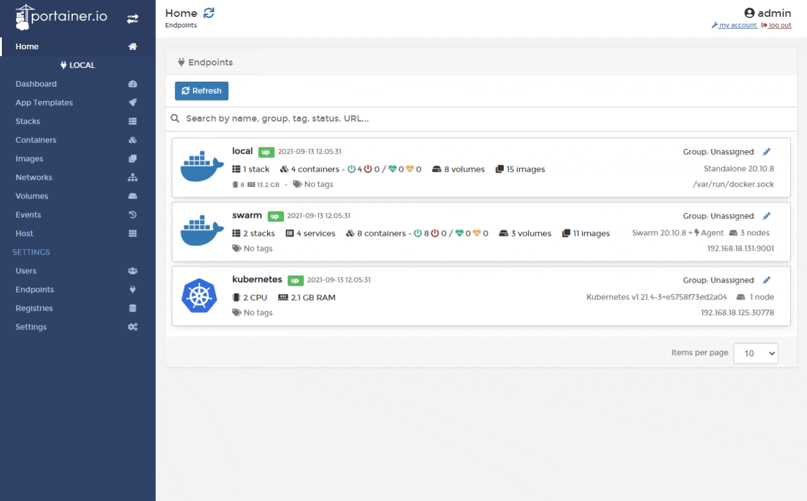
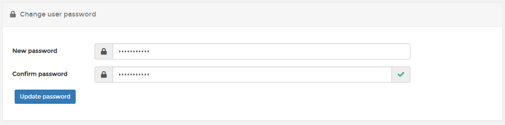

# Reset a user's password

From the menu select **Users **then select the user whose password you want to reset.

Enter a new strong password, re-enter the password to confirm it then click **Update password**.

