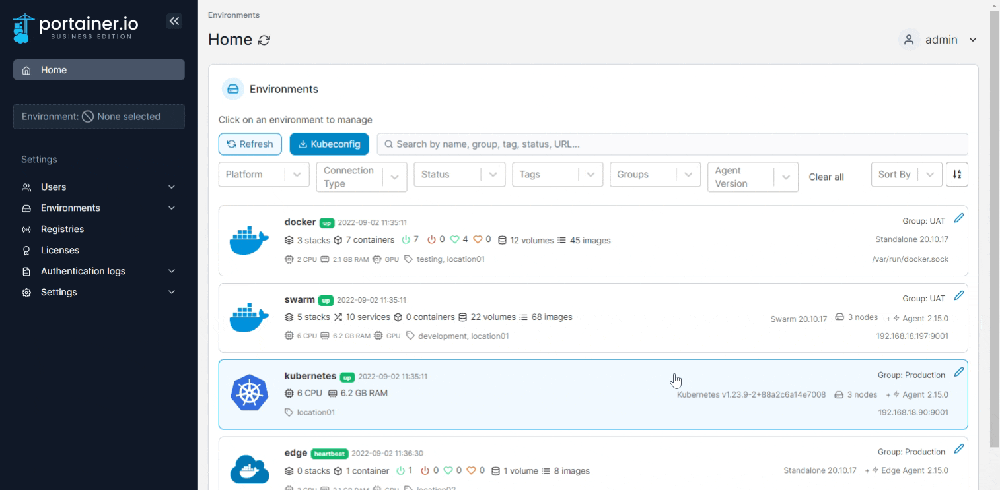

# Turn a user into an administrator

From the menu select **Users** then select the user you want to promote to administrator.

<figure><figcaption></figcaption></figure>

Toggle **Administrator** on then click **Save**.

<figure><figcaption></figcaption></figure>
