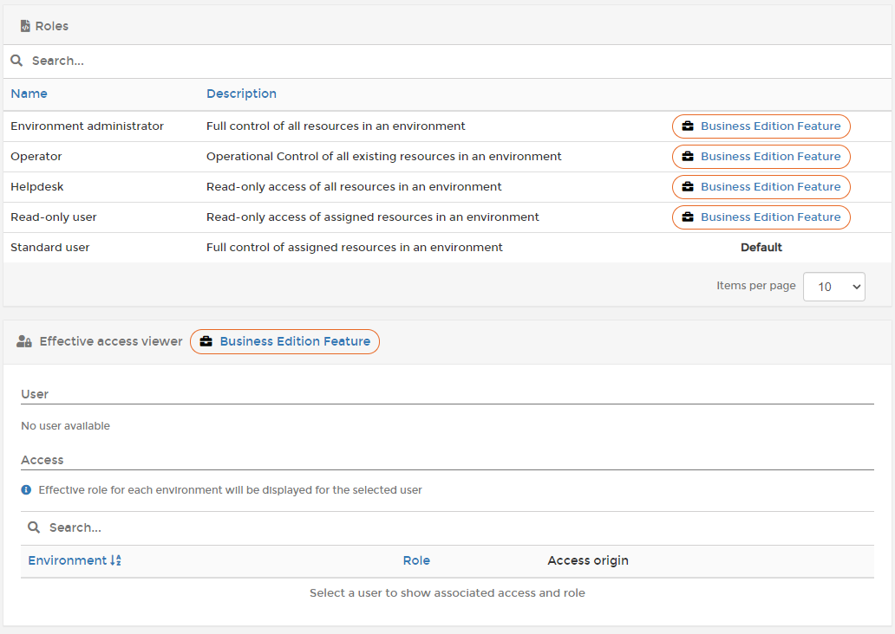

# Roles

Roles are a predefined set of privileges which, when assigned to users, allow access only to the functionality they need.


Roles are only available in [Portainer Business Edition](https://www.portainer.io/business-upsell?from=rbac-roles).


