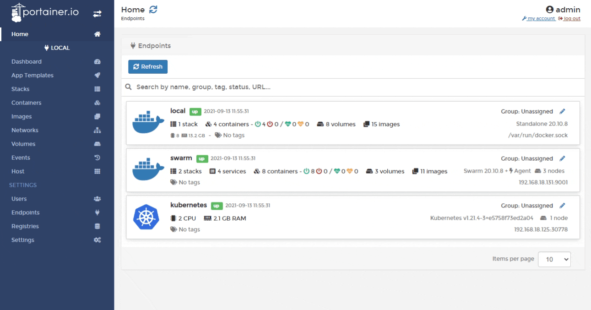
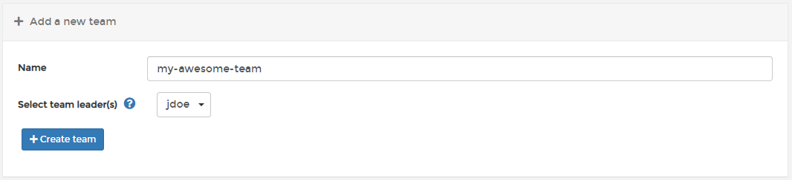

# Add a new team

From the menu select **Users** then select **Teams**.&#x20;

Enter the name of the team and optionally select a team leader. Team leaders can add and remove existing users to and from their team, as well as promote existing team members to co-team leaders.


If your Portainer installation uses external authentication and teams are synced from your external authentication provider, the team leader role is disabled.


When you're ready, click **Create team**.
