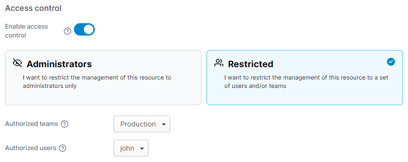

# Access control

All Docker and Docker Swarm resources (except images) deployed through Portainer have access control settings. You can set these when resources are deployed or at a later time. Resources deployed through a stack or a service will inherit the same access as the parent.

## Resources deployed through Portainer

### Access to administrators only

This is an example access control section, showing access control enabled. With these settings, only Portainer administrators will have access to the resource and any other resources created by it (for example, a stack that creates containers, services, volumes, networks and secrets).

<figure><figcaption></figcaption></figure>

### Access to all users

This is an example access control section showing access control disabled. All Portainer users will have access to the resource and any resources created by it.

<figure><figcaption></figcaption></figure>

### Access restricted to specific groups or users

This is an example access control section showing access control enabled in **Restricted** mode. After you select the Restricted option, you can select more teams and users and give them access to the resource.

<figure><figcaption></figcaption></figure>

## Resources deployed outside of Portainer

Any resources deployed to Docker or Docker Swarm outside of Portainer will be marked as `external` and you will have limited control over these resources. By default, these resources will have administrator-only access, but you can enable access control using these labels (examples used, swap out for your own parameters):

| Label                                       | Access Granted                                                                                                          |
| ------------------------------------------- | ----------------------------------------------------------------------------------------------------------------------- |
| `io.portainer.accesscontrol.public`         | All Portainer users have access to the resource. Takes precedence over team/user assignments.                           |
| `io.portainer.accesscontrol.teams=dev,prod` | Access restricted to teams `dev` and `prod` only. Can be used in conjunction with `io.portainer.accesscontrol.users`    |
| `io.portainer.accesscontrol.users=bob,adam` | Access is restricted to users `bob` and `adam` only. Can be used in conjunction with `io.portainer.accesscontrol.teams` |

### Example 1 <a href="#examples" id="examples"></a>

Deploy a stack using Docker Compose and restrict access to teams `dev` and `prod`:

```
version: '3.2'
services:
    ltest:
        image: busybox:latest
        command: "ping localhost"
        labels:
            io.portainer.accesscontrol.teams: dev,prod
```

### Example 2

Deploy a stack using the Docker CLI and restrict access to team `testers` and users `bob` and `adam`:

```
version: '3.2'
services:
    ltest:
        image: busybox:latest
        command: "ping localhost"
        labels:
            io.portainer.accesscontrol.teams: testers
            io.portainer.accesscontrol.users: bob,adam
```

### Example 3

Deploy a container using the Docker CLI and make it accessible to all Portainer users:

```
docker run -d --label io.portainer.accesscontrol.public nginx:latest
```

### Example 4

Deploy a container using the Docker CLI and restrict access to teams `dev` and `prod` and users `bob`:

```
docker run -d --label io.portainer.accesscontrol.teams=dev,prod --label io.portainer.accesscontrol.users=bob nginx:latest
```
