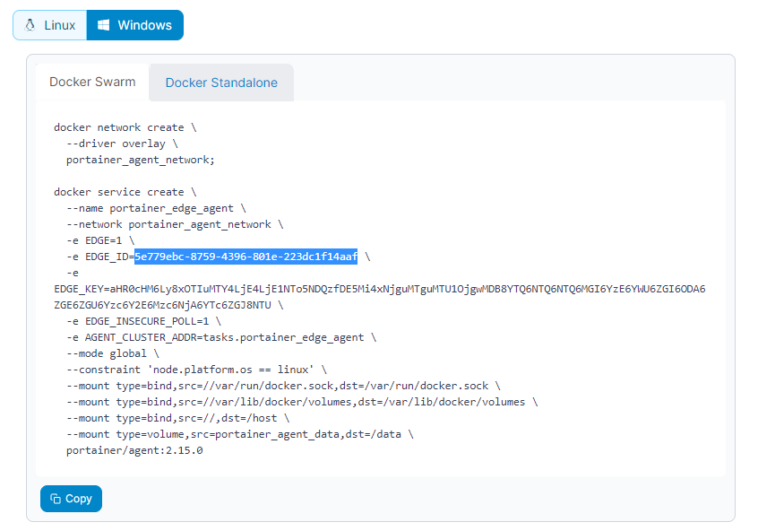
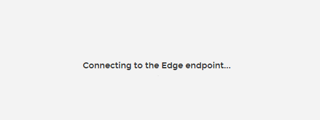
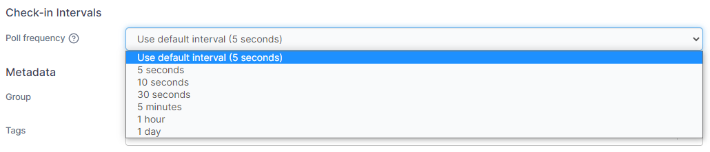

# The Portainer Edge Agent

## The back story


For standard deployments, we used to assume that the Portainer instance and any environments shared the same network and could communicate seamlessly. If remote environments were on a different network (say, across the Internet) we could not manage them.

Then we changed the Edge agent architecture so only the environments need to access Portainer. There is now no need to expose the Portainer agents to the Internet.

Portainer now requires that only the `9443` and `8000` TCP ports are exposed. We used to serve the UI and the Portainer API from port `9000`, but we extended the API to allow the remote agents to poll for instructions. Port `8000` is a TLS tunnel server used to create a secure tunnel between the agent and the Portainer instance. More about that soon.


If your Portainer instance is deployed with TLS, the agent will use HTTPS for the connection it makes back to Portainer. However, if your Portainer instance uses a self-signed certificate, the Edge Agent must be deployed with the `-e EDGE_INSECURE_POLL=1` flag. If you do not deploy the Edge Agent with this flag, the agent won't be able to communicate with the Portainer instance.


## Creating an Edge Agent in Portainer


When you create an Edge Agent, you are first asked for a human-friendly endpoint name. You are then asked to confirm the FQDN:PORT of your Portainer instance. This is what agents will use to connect, so make sure it’s correct and that the DNS resolves.

During the creation process, an Edge ID is dynamically generated. This is a random UUID which is assigned to each environment. You can see it in the command syntax which is provided during the setup process.

<figure><figcaption></figcaption></figure>


The Edge ID and the join token are unique per environment. The join token (`EDGE_KEY`) is made up of the following base64 encoded data separated by the pipe (`|`) character:

* The Portainer instance API URL. This is how the Edge Agent knows how to ‘call home’ to your Portainer instance.
* The Portainer instance reverse tunnel server address. This is identical to the API URL (unless [changed during deployment](../admin/environments/add/docker/edge.md#deploying) or in [Edge Compute settings](../admin/settings/edge.md#edge-compute-settings)) but with the tunnel server port (`8000` is the default).
* The Portainer instance reverse-tunnel server fingerprint (prevents MITM when creating a tunnel).
* The environment identifier key (endpoint / environment ID).

Use the command syntax to deploy an Edge Agent across your remote node or remote swarm cluster.

## How Portainer and the Edge Agent communicate

### Polling



Agents poll the Portainer instance every 5 seconds by default (this is defined in Portainer settings).

### Connection process and checks

The agent says to Portainer, “Hi, I'm an agent. My join token is `abc123`. Do you need me right now?”. Portainer checks its database to ensure the Edge UUID and the join token match. If no UUID can be associated with the join token provided, Portainer will associate the UUID provided by the agent to the environment’s join token.

If the UUID/join token do not match, the connection is rejected. If the UUID/join token match, the Portainer instance responds with either: "No, I don’t need you. Please check in again in X seconds." (where X is the agent polling frequency), or "Yes, I do need you. Please connect using these tunnel credentials.”.


Portainer encrypts the tunnel credentials using the Edge UUID as the encryption key (intended as one-time-use credentials).


### Opening a tunnel between the agent and Portainer

Once confirmation is received, the Edge Agent decrypts the credentials and opens a tunnel on port `8000` to the Portainer instance. If a remote environment is a swarm cluster, every node will run an instance of the agent (and every instance will poll Portainer). The 'you are required' flag causes the first agent in the cluster to establish the tunnel. Once in place, Portainer can then query the agent where the tunnel is open. If the tunnel closes for any reason, the agent will immediately re-establish it.

### When Portainer forces the Edge Agent to establish a tunnel

Sometimes Portainer will ask the agent to establish a tunnel. This happens when an admin selects an Edge environment for interactive management via the Portainer UI or the API. Once selected, the 'you are required' flag triggers the connection process. If default settings are in use, it takes about 10 seconds for the agent to poll and establish a tunnel. That’s about 5 seconds wait time until polling then a few seconds for the tunnel to open. The admin is shown this message while this happens:

### Terminating the connection

The agent keeps a record of when Portainer last communicated with it. After 5 minutes of inactivity, it sends a snapshot of the current config to Portainer for its records, closes the tunnel and revokes the credentials. When admins have an active session with an Edge environment, ‘keep alives’ are sent every minute (even if the admin is not performing a task) so they are not kicked out by mistake.

## Network performance

### Adjusting the polling frequency to improve performance

Thousands of endpoints polling Portainer every 5 seconds is a lot. That’s about 324b/second per agent, not per environment. If you don’t do a lot of environment admin, we suggest you go into Portainer settings and increase the polling frequency. Simply change it back when you need to do some admin so you are not kept waiting.

<figure><figcaption></figcaption></figure>

### Ongoing improvements

We load-tested Portainer with 15,000 actively connected environments with a polling frequency of 5 seconds. This generated 7Mbps of network traffic to the Portainer instance, and Portainer needed 4 CPUs to handle the encryption/tunnel load. This Edge Agent release is our first attempt at massive-scale centralized management. Our end goal is to reduce the network overhead associated with polling.
