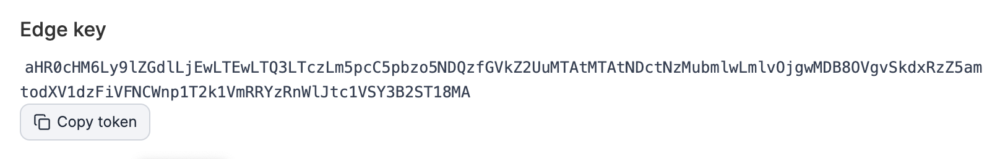
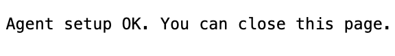

# How to prestage an Edge Agent environment

When creating an Edge Agent environment, if the `EDGE_KEY` environment variable is omitted from the Edge Agent startup command, you can allow the agent to start an HTTP server and expose a pairing UI where you can associate the Edge key later. The following instructions lay out how to deploy the agent without the key and start the pairing UI.

#### Step 1: Deploy the agent without an Edge key

From your chosen environment creation view, copy the generated script, remove the -e EDGE\_KEY variable, and add a port mapping for the agent's HTTP server instead:

```
-p 80:80 \
```


To expose the server on a different host port, use `-p <custom-port>:80 \`.



```
docker run -d \
    -v /var/run/docker.sock:/var/run/docker.sock \
    -v /var/lib/docker/volumes:/var/lib/docker/volumes \
    -v /:/host \
    -v portainer_agent_data:/data \
    --restart always \
    -e EDGE=1 \
    -e EDGE_ID=$PORTAINER_EDGE_ID \
    -p 80:80 \
    -e EDGE_INSECURE_POLL=1 \
    --name portainer_edge_agent \
    portainer/agent:LTS
```


#### Step 2: Copy the join token

In Portainer, select **Copy token** to copy the Edge key token.


If you've navigated away, select the unassociated environment from the **Environment related** > **Environments** view to return to its details page and copy the token from there.


<figure><figcaption></figcaption></figure>

#### Step 3: Open the pairing UI

In a new browser tab, navigate to `<ip-address>:80`, replacing `<ip-address>` with the IP of your Edge environment. If you used a custom port, replace `80` accordingly.

You should see the Agent Pairing screen. Paste the Edge key token into the text box and select **Submit**.


The pairing UI goes offline after 15 minutes if no token is submitted. Restart the Edge Agent to access it again.


<figure><figcaption></figcaption></figure>

Once you have entered the token, you should see a confirmation dialog that the agent has been set up successfully. The environment will now appear as associated in the environments view.

<figure><figcaption></figcaption></figure>
