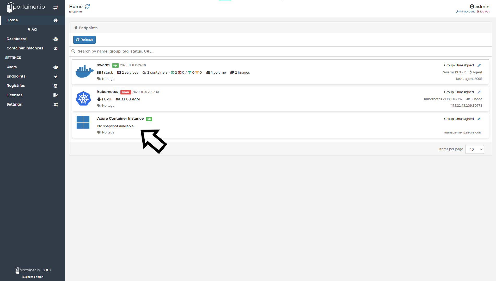
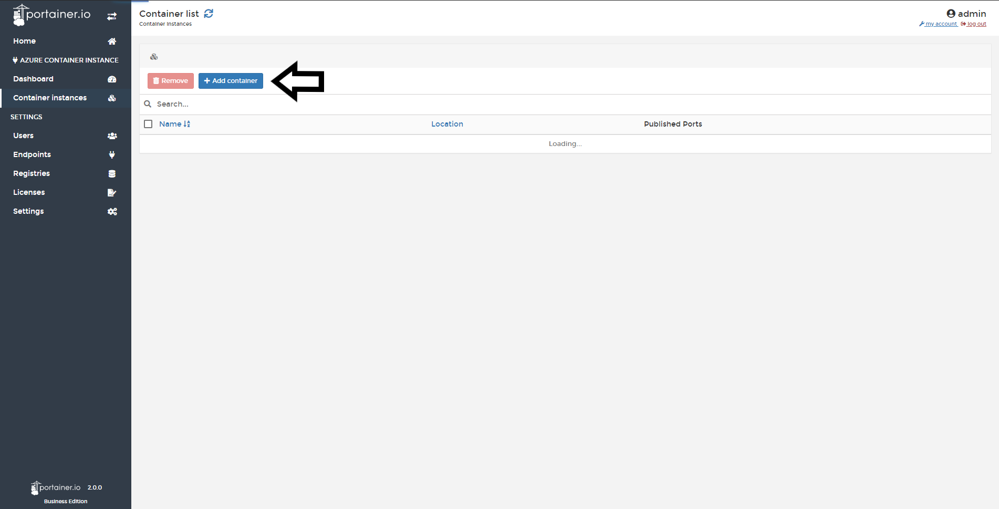
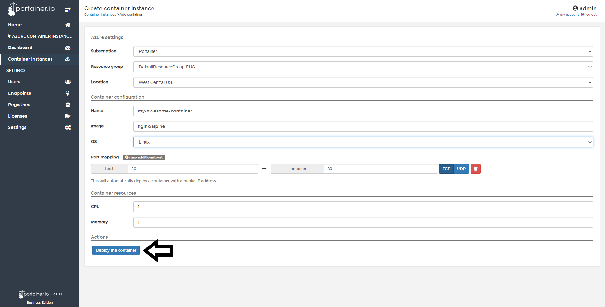
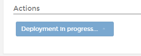
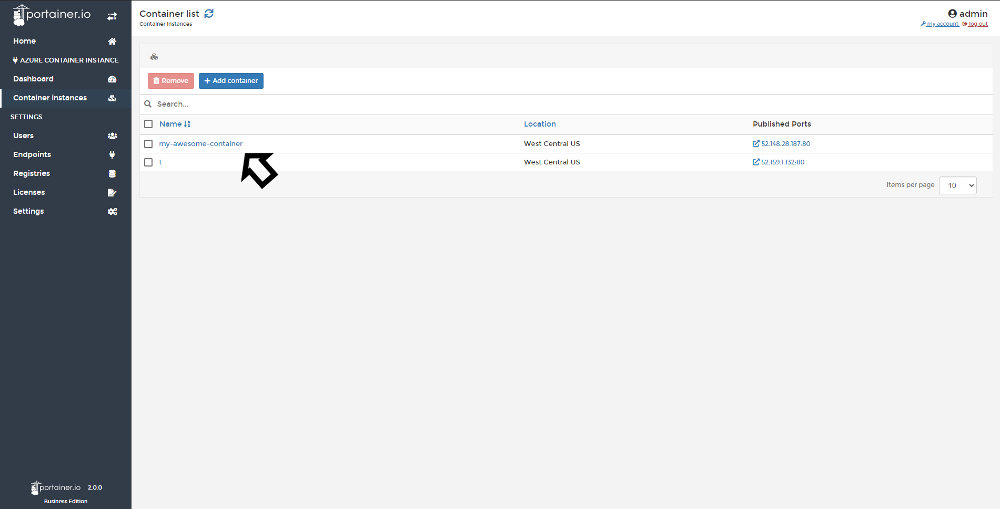

# Add a Container Instance

From Portainer you can add new containers in your Azure Container Instance service.

## Adding a New Container Instance

From Portainer Home, click in your Azure Container Instance <b>endpoint</b>. 

Click <b>Container Instances</b> and then <b>Add Container</b>.

In the next screen, you need to define the container configuration, these options are available:

* Subscription: If you have two or more subscriptions attached, you can choose where you want to deploy your container.
* Resource Group: If you have two or more Resources groups created, you need to define where you want to deploy your container.
* Location: Here you need to define in which datacenter you want to run your container.
* Name: Name your container.
* Image: Type the name of the image you want to deploy.
* OS: Select the appropriate OS, usually Linux or Windows.
* Port Mapping: Choose what port you need to publish to the Internet.
* CPU: Define how much CPU you want for your container.
* Memory: Define how much memory you want for your container.

When everything is set, click <b>Deploy the Container</b>.

Meanwhile the deployment is in progress this message will show in the button.

After the deployment has completed, Portainer will exit to the container list and you will see your new container deployed in Azure Container Instances.

## :material-note-text: Notes

[Contribute to these docs](https://github.com/portainer/portainer-docs/blob/master/contributing.md){target=_blank}
