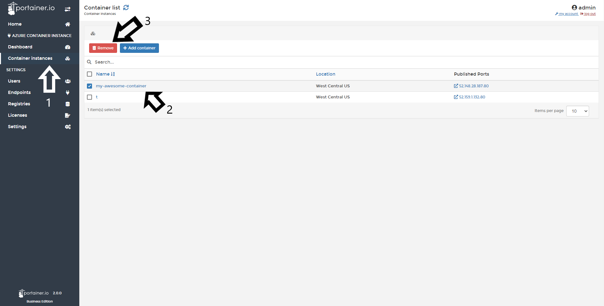
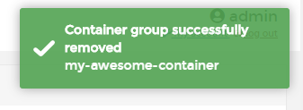

# Delete a Container

From Portainer, you can delete your containers running in Azure containers instances.

## Deleting containers

Click <b>Container Instances</b>, select the container you want to delete and click <b>Remove</b>.

After removing the container, you will see a pop up confirming that action. 

## Notes

[Contribute to these docs](https://github.com/portainer/portainer-docs/blob/master/contributing.md).