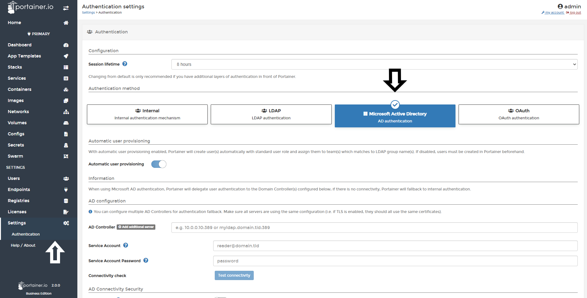
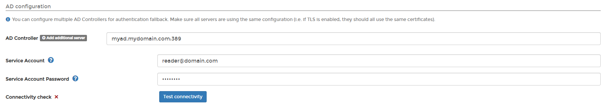
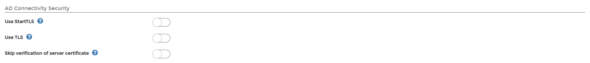
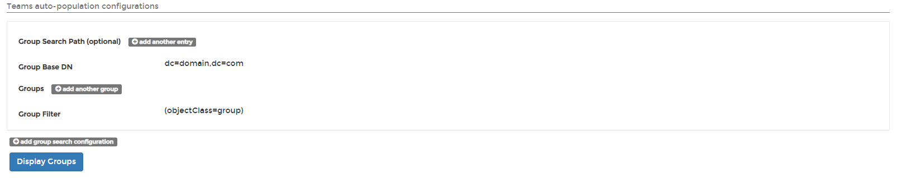
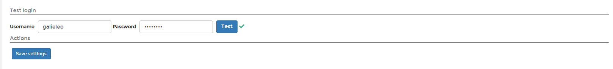

# Enable Microsoft Active Directory authentication

Portainer Business Edition, offer you the posibility to connect to a existent Microsoft Active Directory to manage your authentication settings in Portainer. In this help article, we going to explan how to configure it. 

## Configuring Active Directory in Portainer

### AD Configuration

To start to configure Active Directory authentication, go to <b>Settings</b> > <b>Authentication</b> and select <b>Microsoft Active Directory</b>.

Now, you can start to configure your Active Directory. To start, you need to define a few details:

* AD Controller: Here, you can enter the FQDN or IP address of your Domain Controller.
* Service Account: Witch would be the account that we handle the connection with AD and search users.
* Service Account Password: Password for this account.

### AD Connectivity Security

Here, you can define, the following options:

* Use StartTLS: Enable this option if want to use StartTLS to secure the connection to the server. Ignored if Use TLS is selected.
* Use TLS: Enable this option if you need to specify TLS certificates to connect to the LDAP server.
* Skip verification of server certificate: Skip the verification of the server TLS certificate. Not recommended on unsecured networks.

### User search configurations

* In this section, you can configure the <b>Username format</b>. This is how your users will log in to Portainer, the options are using <b>Username</b> or a full username <b>user@domain.com</b>
* Root Domain: Will use the domain of the address to the Domain Controller.
* User Search Path (optional): Here you can define differents OU or Folder.
* Allowed Groups (optional): You can specify specific groups of the directory to access to Portainer.
* User Filter: Is filled by default according to OpenLDAP configuration.

### Teams auto-population configurations

* Group Search Path (optional): Here you can define differents OU or Folder.
* Group Base DN: Will be used the DN used when you authenticate to the Domain Controller.
* Groups: Here you can define differents OU or Folder.
* Group Filter: Is filled default according to OpenLDAP configuration.

### Test Login

If you want to know if your configuration is valid, you can run a test login from the configuration of Active Directory settings. Scroll down to <b>Test Login</b> Section, fill with a valid user and password and do a click in <b>Test</b>. If everything is work as expected, you will see a check beside of the button.

## :material-note-text: Notes

[Contribute to these docs](https://github.com/portainer/portainer-docs/blob/master/contributing.md){target=_blank}