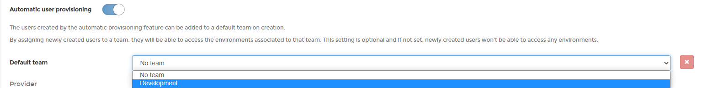

# Automatic User Provisioning

When you configure any external authentication method in Portainer Business Edition, Portainer will create user(s) automatically with the standard user role. If disabled, users must be created beforehand in Portainer in order to login.

## Enabling Automatic Provisioning

To enable <b>Automatic Provisiong</b> go to settings > Authentication and when you select your preferred external authentication type technology, enable the toggle <b>Automatic User Provisioning</b>, after that, you need to specify a team where the users from this external authentication source going to be saved.

## Notes

[Contribute to these docs](https://github.com/portainer/portainer-docs/blob/master/contributing.md).