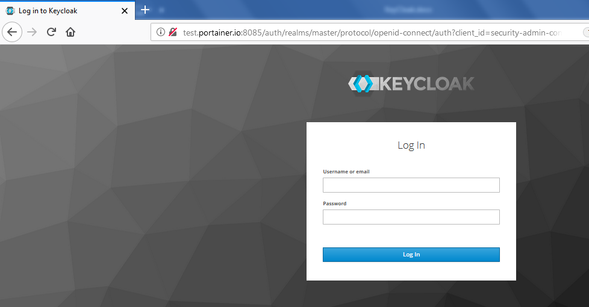
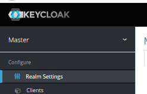
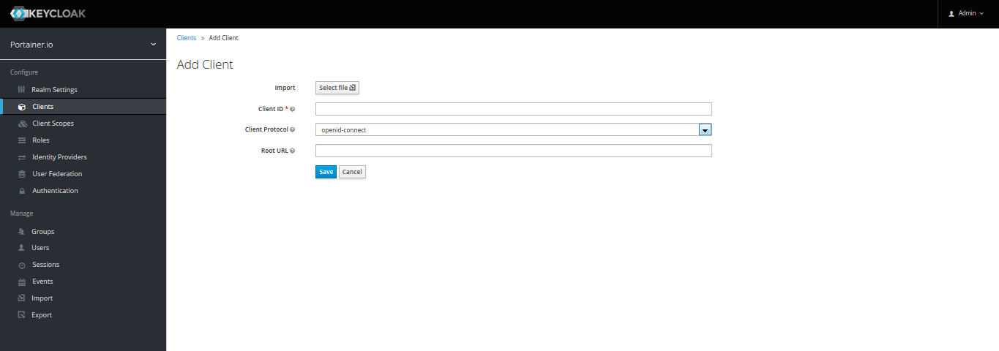
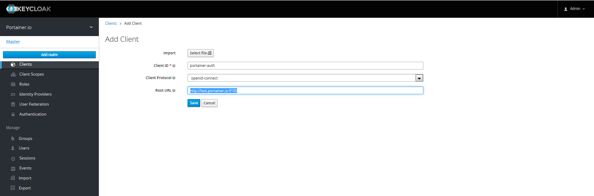
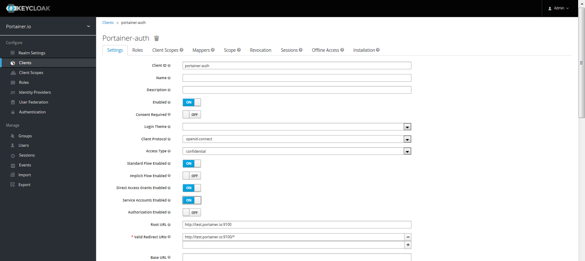
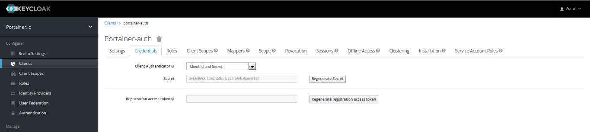

# :material-account-settings: Custom OAuth Provider

Portainer Business Edition can be connected to several OAuth providers.

## :fontawesome-solid-clipboard-list: Requirements
You will need to have the following info handy before configuring OAuth.

* <b>Client ID</b>: This is the public identifier of the OAuth application.
* <b>Client Secret</b>: Here, you need fill with the token access to the OAuth Application.
* <b>Authorization URL</b>: URL used to authenticate against the OAuth provider. Will redirect the user to the OAuth provider login view.
* <b>Access Token URL</b>: URL used to authenticate against the OAuth provider. Will redirect the user to the OAuth provider login view.
* <b>Resource URL</b>: URL used by Portainer to retrieve information about the authenticated user.
* <b>Redirect URL</b>: URL used by the OAuth provider to redirect the user after successful authentication. Should be set to your Portainer instance URL.
* <b>User Identifier</b>: Identifier that will be used by Portainer to create an account for the authenticated user. Retrieved from the resource server specified via the Resource URL field.
* <b>Scopes</b>: Required by the OAuth provider to retrieve information about the authenticated user. Refer to your OAuth provider documentation for more information about this.

We will use <b>KeyCloak</b> as an example Provider and steps to obtain these:

1. Login to KeyCloak Administration Console as an Admin
    

2. Select the applicable authentication “Realm” from the dropdown in the left sidebar
    

3. Click on “Clients”, in the left sidebar, and then click the “Create” button to define a new app instance.
    
In the “Client ID” enter in (and record) a name for the Portainer App instance you are authorising. Something like portainer-auth. Keep the client protocol as openid-connect, and for the root URL enter in the FDQL of your Portainer instance, as below, and then click “Save”.
    
Now change the “Access Type” to “confidential”, and switch “Service Accounts Enabled” to “ON”, then click “Save”. Note that once you click “Save” a new header menu items appears, called “Credentials”. Click on that menu.
    
Take a note of the <b>Secret</b>; this will be required later.
    
Now, we assume you already have users defined in your KeyCloak system, but if not, click on “Users” in the left sidebar and add users as required.

## :fontawesome-solid-users-cog: Configuration

To configure a custom OAuth provider, once you logged to Portainer, click <b>Settings</b> and then <b>authentication</b>. After that, select <b>custom</b> option.

In this screen, you need to configure the data that you OAuth provider give you to configure Portainer. The fields are:

* Automatic User Provisioning: Toggle on these options if you want to create users for each user logged using OAuth. After enable the toggle, you need to define in wich team that users should be created. 

* Client ID
* Client Secret
* Authorization URL
* Access Token URL
* Resource URL
* Redirect URL
* User Identifier
* Scopes

Once that all fields are completed, click <b>Save Settings</b>

## Manage access to OAuth Team and Users

To understand how to enable access to OAuth Teams and Users, please, refer to [this article](/v2.0-be/endpoints/access).

## :material-note-text: Notes

[Contribute to these docs](https://github.com/portainer/portainer-docs/blob/master/contributing.md){target=_blank}