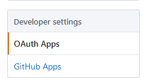
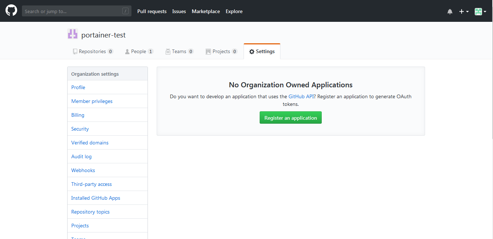
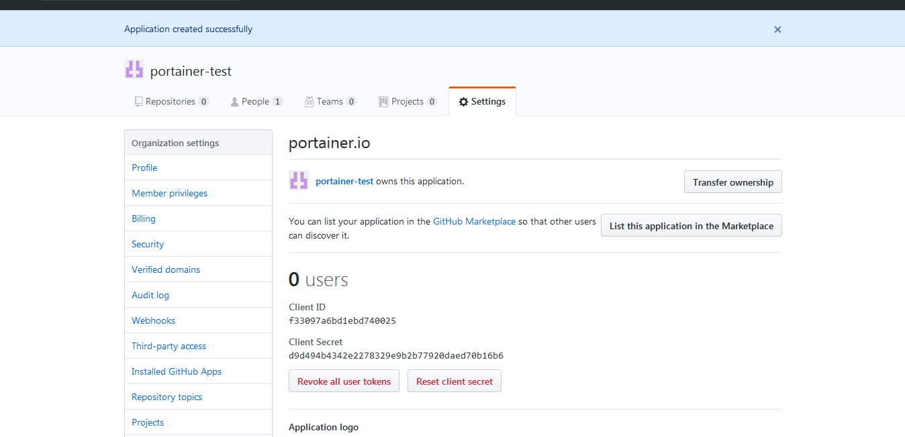
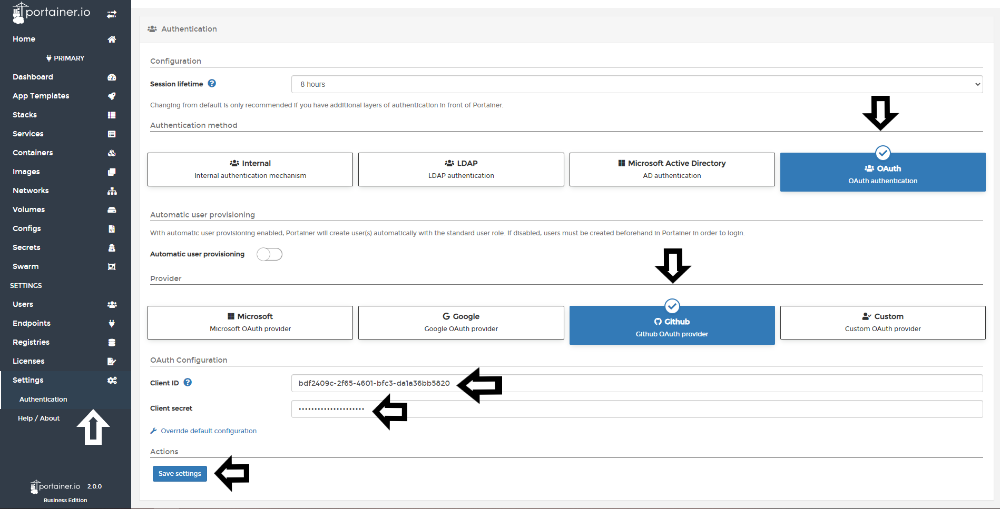

# :fontawesome-brands-github: Github OAuth Provider

Portainer Business can be connected to Github OAuth provider in an easy way without need to understand complex configuration.

## :fontawesome-solid-clipboard-list: Requirements

You will need to have the following info handy before configuring OAuth using Github Provider.

* <b>Client ID</b>: Public identifier of the OAuth Application.
* <b>Client Secret</b>: The secret of this client.

You can obtain these details by following the steps below:

1. Login to Github as an Org Admin,
Select “OAuth Apps” from Develop Settings sub menu in the left sidebar
    

2. Click on “Register an application”
    
In “Application Name” enter a friendly name
In “Homepage URL” and “Authorisation callback URL”, text boxes, enter the full URL to your Portainer instance, and then click “Register Application”
    

3. Note your <b>Client ID</b> and <b>Client Secret</b>, and record for later use.
    

## :fontawesome-solid-users-cog: Configuration

To start to configure Github OAuth Provider, once you logged into Portainer, click <b>Settings</b> and then <b>authentication</b>. After that, select <b>OAuth</b> option and then, select <b>Github</b>.

Define the following information and click <b>Save settings</b>.

* Client ID
* Client Secret

## Manage access to OAuth Team and Users

To understand how to enable access to OAuth Teams and Users, please, refer to [this article](/v2.0-be/endpoints/access).

## :material-note-text: Notes

[Contribute to these docs](https://github.com/portainer/portainer-docs/blob/master/contributing.md){target=_blank}