# :fontawesome-brands-google: Google OAuth Provider

Portainer Business can be connected to Google OAuth provider in an easy way without need to understand complex configuration.

## :fontawesome-solid-clipboard-list: Requirements
You will need to have the following info handy before configuring OAuth using Google Provider.

* <b>Client ID</b>: Public identifier of the OAuth Application.
* <b>Client Secret</b>: The secret of this client.

You can obtain these details by following the steps below:

1. Login to your Google Cloud Portal (console.cloud.google.com) as an Admin
    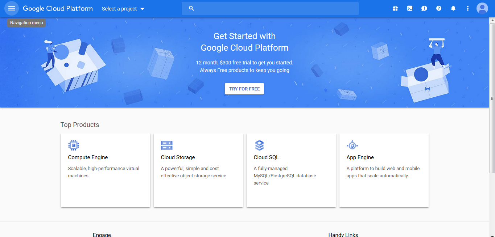

2. Click on “Select Project”, then select your Org, and then select “NEW PROJECT”
    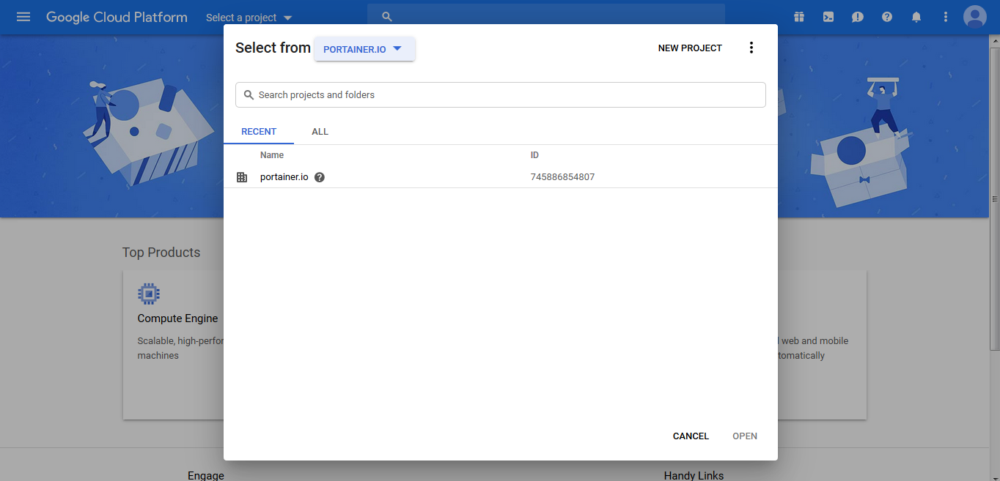

3. Give the project a name, such as portainer-login, and then click “Create”
    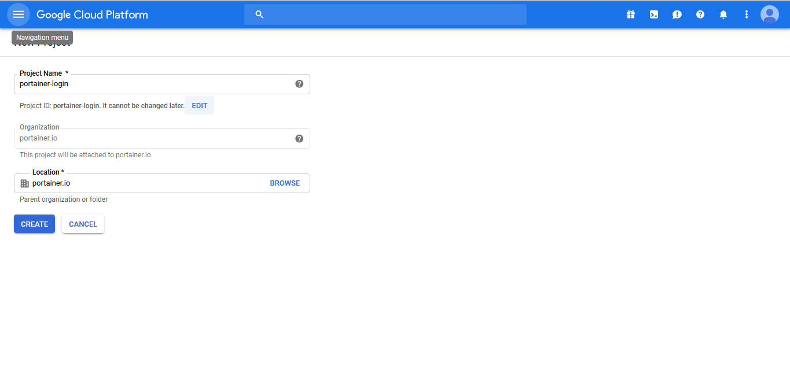

4. Wait for the project to be created (30 seconds), and then click on the navigation bar, and select “APIs & Services”, Credentials.
    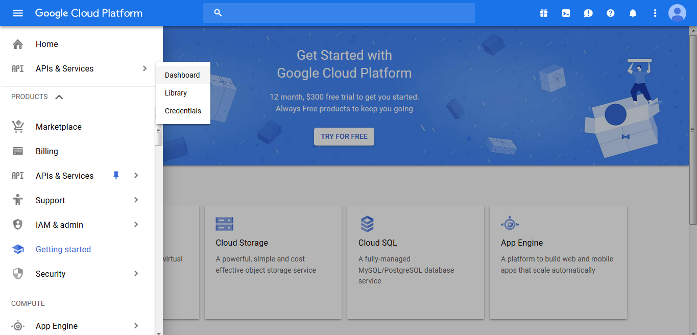
Select the drop down list in the header bar, and change the focus to the “portainer-login” project
    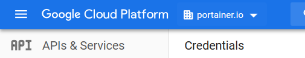
    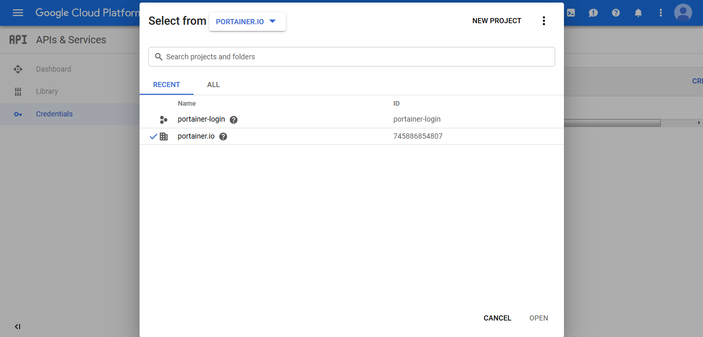

5. Click on “OAuth consent screen”
Change the application type to “Internal”
In the “Application name” input box, enter the project name “portainer-login”
Scroll down to authorised domains, and enter in the FQDN of the server that hosts your Portainer instance (in our case, test.portainer.io)
    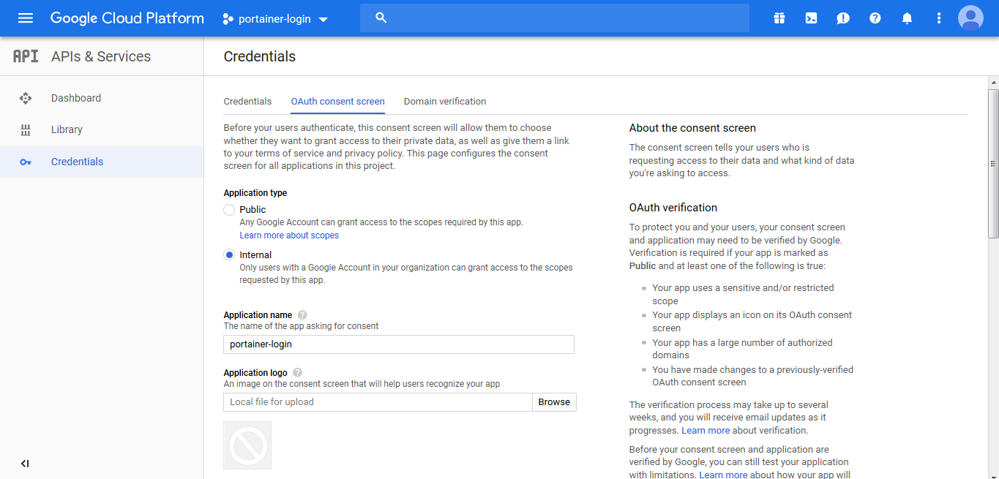
    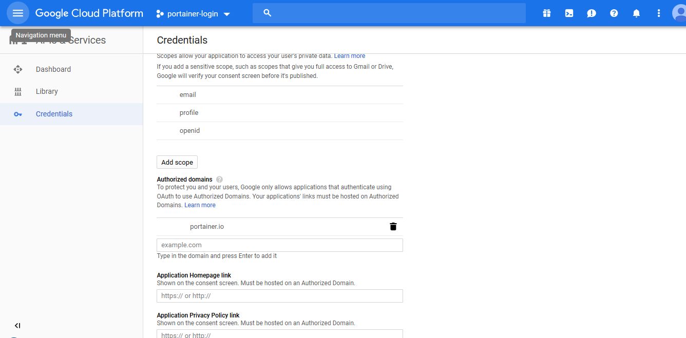
Click Save.

6. Click on “Credentials”, and then “OAuth Client ID”
    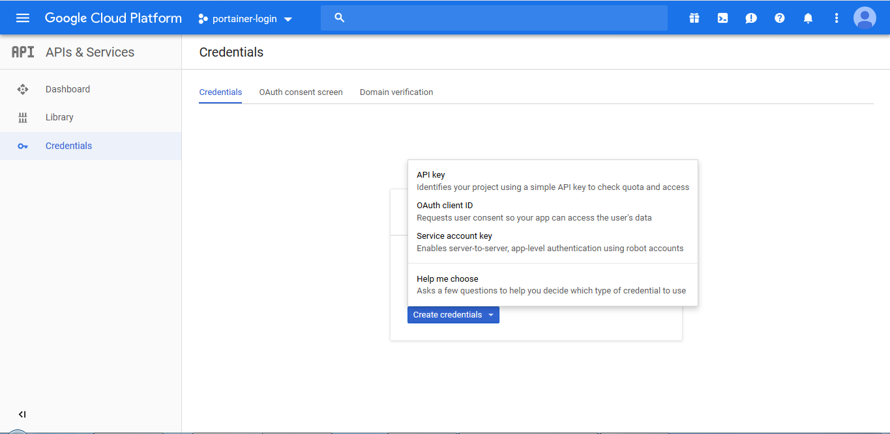
Select “Web Application” as the Application Type,
In the “Name” input box, enter the project name “portainer-login”
In the “Javascript Origins” and “Redirect URI” text boxes, enter in the FDQN and Port of your Portainer instance
    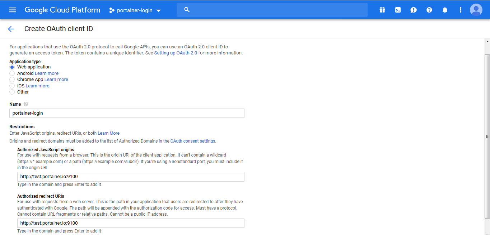
Click “Create”
You will now be presented with your API tokens, copy <b>Client ID</b> and <b>Client Secret</b> for later use (note be careful with trailing spaces as the auto-copy adds a trailing space, which breaks things)
    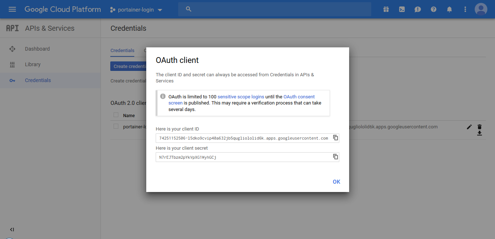

## :fontawesome-solid-users-cog: Configuration
To start to configure Google OAuth Provider, once you logged to Portainer, click <b>Settings</b> and then <b>authentication</b>. After that, select <b>OAuth</b> option and then, select <b>Google</b>.

Define the following information and click <b>Save settings</b>.

* Client ID
* Client Secret

## Manage access to OAuth Team and Users

To understand how to enable access to OAuth Teams and Users, please, refer to [this article](/v2.0-be/endpoints/access).

## :material-note-text: Notes

[Contribute to these docs](https://github.com/portainer/portainer-docs/blob/master/contributing.md){target=_blank}