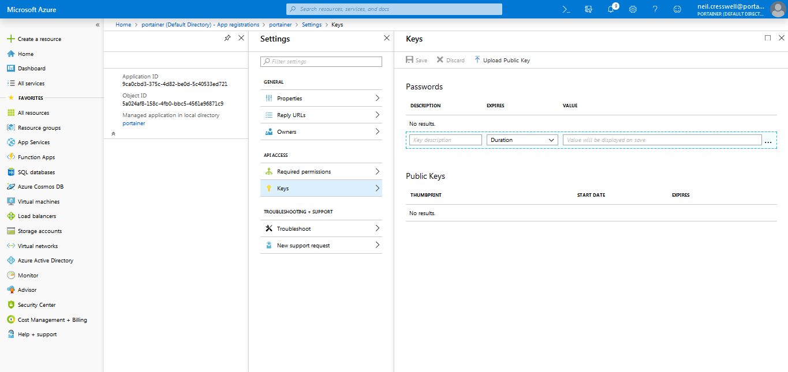

# :material-microsoft-azure: Microsoft OAuth Provider

<iframe src="//www.youtube.com/embed/Wlpnq5SF0dw" 
frameborder="0" allowfullscreen class="video"></iframe>

 

## :fontawesome-solid-clipboard-list: Requirements
You will need to have the following info handy before configuring OAuth using Microsoft Provider.

* <b>Tenant ID</b>: ID of the Azure Directory you wish to authenticate against. Also known as the Directory ID.
* <b>Application ID</b>: Public identifier of the OAuth application.
* <b>Application key</b>: The secret of this Application.

You can obtain these details by following the steps below:

1. Login to your Azure Portal as an Admin
    

2. Retrieve your Tenant ID / Directory ID; 
Click on “Azure Active Directory”, and then Click on “Properties”, and then note your <b>Directory ID</b> for later use.
    

3. Define your Portainer Instance
Still in Azure Active Directory, Click on App Registrations
Click on “+ New Application Registration”
    
Enter in a friendly name for the Portainer Instance
Keep the app type as Web App / API
In the “Sign-on URL” field, enter the FQDN or IP address that your Portainer instance listens on.
    

4. Retrieve the Application ID
After creating the app, the screen below is displayed; record the <b>Application ID</b> for later use
    

5. Create The Application login key
Click on “Settings”, then “Keys”
    
Under the “Passwords” section, create a new key called “login”, set the Duration to “never expires”, and then click Save.
The Key will then be generated for you. Note this <b>Application Key</b> Value for later use.
    

## :fontawesome-solid-users-cog: Configuration

To start to configure Microsoft OAuth Provider, once you logged into Portainer, click <b>Settings</b> and then <b>authentication</b>. After that, select <b>OAuth</b> option and then, select <b>Microsoft</b>.

Here, you only need to define the following information: 

* Tenant ID
* Application ID
* Application key

Click <b>Save Settings</b> and you're done.

## Manage access to OAuth Team and Users

To understand how to enable access to OAuth Teams and Users, please, refer to [this article](/v2.0-be/endpoints/access).

## :material-note-text: Notes

[Contribute to these docs](https://github.com/portainer/portainer-docs/blob/master/contributing.md){target=_blank}