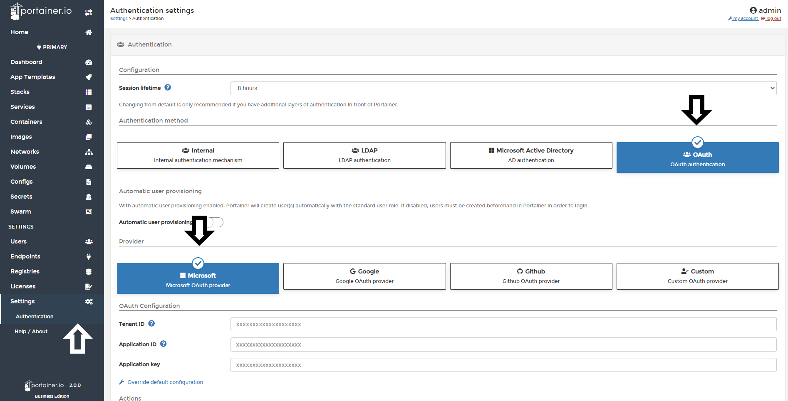
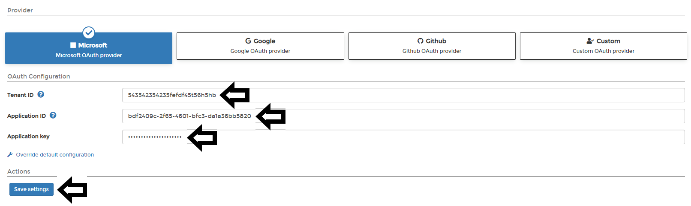
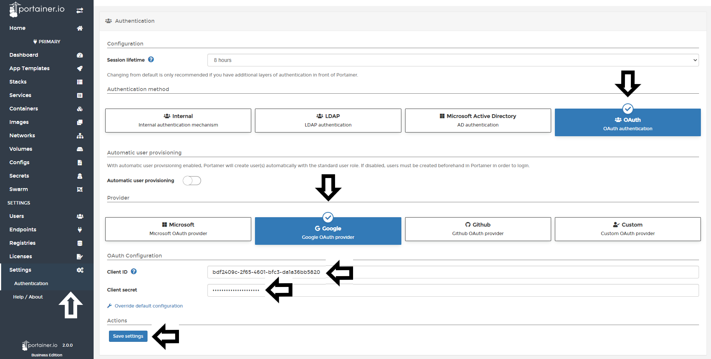
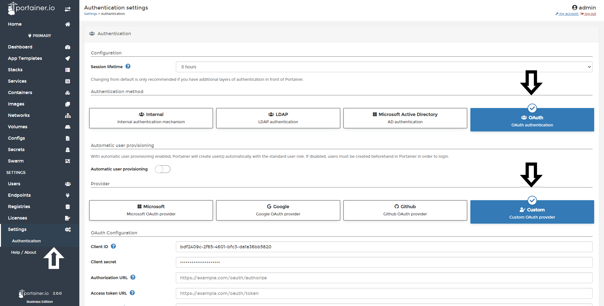
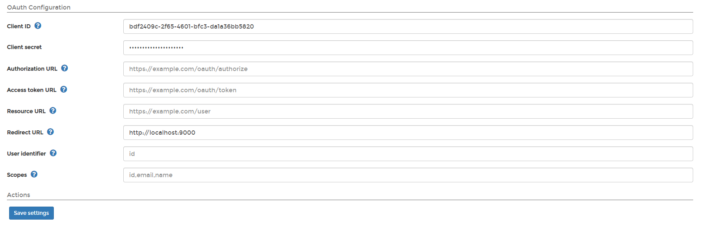

# OAuth authentication

Portainer Business Edition can be connected to several OAuth providers in an easy way without need to understand complex configurations.

### Microsoft OAuth Provider

To start to configure Microsoft OAuth Provider, once you logged to Portainer, click in <b>Settings</b> and then in <b>authentication</b>. After that, select <b>OAuth</b> option and then, do select <b>Microsoft</b>.

Here, you only need to define the following information: 

* Tenant ID: ID of the Azure Directory you wish to authenticate against. Also known as the Directory ID.
* Application ID: Public identifier of the OAuth application.
* Application key: The secret of this Application.

Do a click in save and you're done.

### Google OAuth Provider

To start to configure Google OAuth Provider, once you logged to Portainer, click in <b>Settings</b> and then in <b>authentication</b>. After that, select <b>OAuth</b> option and then, do select <b>Google</b>.

Define the following information and do a click in <b>Save settings</b>.

* Client ID: Public identifier of the OAuth Application.
* Client Secret: The secret of this client.

### Github

To start to configure Github OAuth Provider, once you logged to Portainer, click in <b>Settings</b> and then in <b>authentication</b>. After that, select <b>OAuth</b> option and then, do select <b>Github</b>.

Define the following information and do a click in <b>Save settings</b>.

* Client ID: Public identifier of the OAuth Application.
* Client Secret: The secret of this client.

### Custom OAuth Provider

To configure a custom OAuth provider, once you logged to Portainer, click in <b>Settings</b> and then in <b>authentication</b>. After that, select <b>custom</b> option.

In this screen, you need to configure the data that you OAuth provider give you to configure Portainer. The fields are:

* Automatic User Provisioning: Toggle on these options if you want to create users for each user logged using OAuth. After enable the toggle, you need to define in wich team that users should be created. 

* Client ID: This is the public identifier of the OAuth application.
* Client Secret: Here, you need fill with the token access to the OAuth Application.
* Authorization URL: URL used to authenticate against the OAuth provider. Will redirect the user to the OAuth provider login view.
* Access Token URL: URL used to authenticate against the OAuth provider. Will redirect the user to the OAuth provider login view.
* Resource URL: URL used by Portainer to retrieve information about the authenticated user.
* Redirect URL: URL used by the OAuth provider to redirect the user after successful authentication. Should be set to your Portainer instance URL.
* User Identifier: Identifier that will be used by Portainer to create an account for the authenticated user. Retrieved from the resource server specified via the Resource URL field.
* Scopes: Required by the OAuth provider to retrieve information about the authenticated user. Refer to your OAuth provider documentation for more information about this.

Once that all fields are completed, do a click in <b>Save Settings</b>

## Manage access to OAuth Team and Users

To understand how to enable access to OAuth Teams and Users, please, refer to [this article](/v2.0-be/endpoints/access).

## Notes

[Contribute to these docs](https://github.com/portainer/portainer-docs/blob/master/contributing.md).