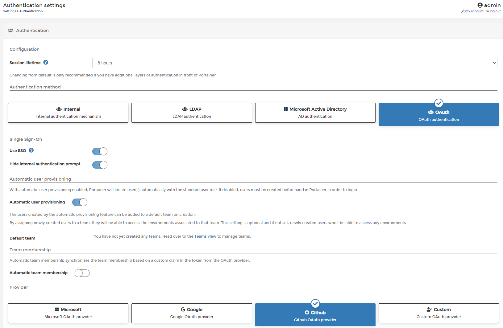

# OAuth authentication

Portainer Business Edition can be connected to several OAuth providers in an easy way without need to understand complex configurations.

To configure OAuth as the external authentication source for Portainer, go to <b>Settings</b> > <b>Authentication</b> and select <b>OAuth</b>.



In this screen, you have the following options:

* Use SSO: Using SSO, the OAuth provider is not forced to prompt for credentials when the user has a currently logged in session.
* Hide internal authentication prompt: With this toggle on, Portainer will bypass the Portainer Login screen and use SSO to login a user with an existing OAuth session or takes the user straight to OAuth provider login.

&nbsp;   &nbsp;  &nbsp;   &nbsp;  &nbsp;   &nbsp;  <b>Note:</b> Use ```<portainer url>/#!/internal-auth``` to login as Portainer internal admin

* Automatic User Provisioning: Toggle on the Automatic User Provisioning to see the options. You can use this option if you want a user added to Portainer for each OAuth user on first login. After enabling the toggle, you may choose a team for these Auto Populated Users.
* Automatic Team membership: You may choose to auto add OAuth users to certain Portainer teams based on the Claim Name. Claim names with be matched with Teams or you can manually link a claim name (regex) with Portainer Teams.


<b>Provider</b>

You may choose any of the following providers or use Custom Provider.

Click on the name for provider specific instructions

* [Microsoft](/v2.0-be/auth/oauth-ms/)
* [Google](/v2.0-be/auth/oauth-google/)
* [Github](/v2.0-be/auth/oauth-github/)
* [Custom](/v2.0-be/auth/oauth-cust/)

## Manage access to OAuth Team and Users

To understand how to enable access to OAuth Teams and Users, please, refer to [this article](/v2.0-be/endpoints/access/).
</br>

## :material-note-text: Notes

[Contribute to these docs](https://github.com/portainer/portainer-docs/blob/master/contributing.md){target=_blank}