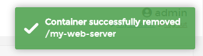

# Delete/Remove a container

In Portainer, you can Remove/Delete containers in simply and easily.

## Deleting Containers

To delete a container, click <b>Containers</b>, then check the container you want delete and select <b>Remove</b>

A pop-up will ask for confirmation, and ask you decide if you want to <b>automatically the non-persistent volumes</b>. Once you selection has been made, click <b>Remove</b>

If successfully removed, a pop up will confirm this.

## :material-note-text: Notes

[Contribute to these docs](https://github.com/portainer/portainer-docs/blob/master/contributing.md){target=_blank}