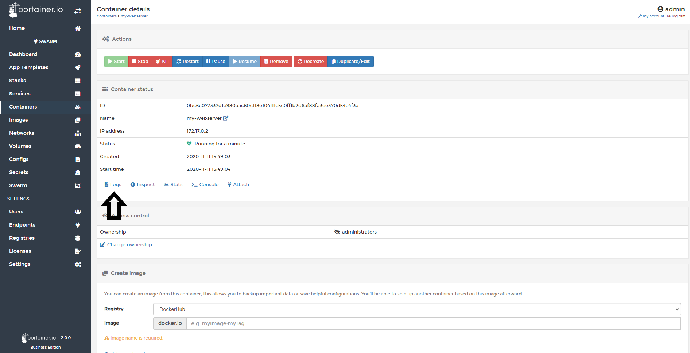

# View Containers Logs

Viewing container logs is one of the most important features for troubleshooting and investigation. 

## Viewing Containers Logs

To view a container logs, click <b>Containers</b> and then select your container. 

Then click <b>Logs</b>

In the following screen, you will see a few options:

* Auto-refresh logs: Disabling this option allows you to pause the logs collection process and the auto-scrolling.
* Wrap lines: To allow easier reading of long lines of logs.
* Display timestamps: this options is useful when you need to find specific time and date logs.
* Fetch: This option allows you to filter the logs by day, hours or minutes.
* Search: You can find specific words in the logs, very useful for finding specific errors.
* Lines: Specify how many lines you want to the see in the logs; default is 100. 
* Actions: You can copy all the logs displayed or a select number of lines.

## :material-note-text: Notes

[Contribute to these docs](https://github.com/portainer/portainer-docs/blob/master/contributing.md){target=_blank}