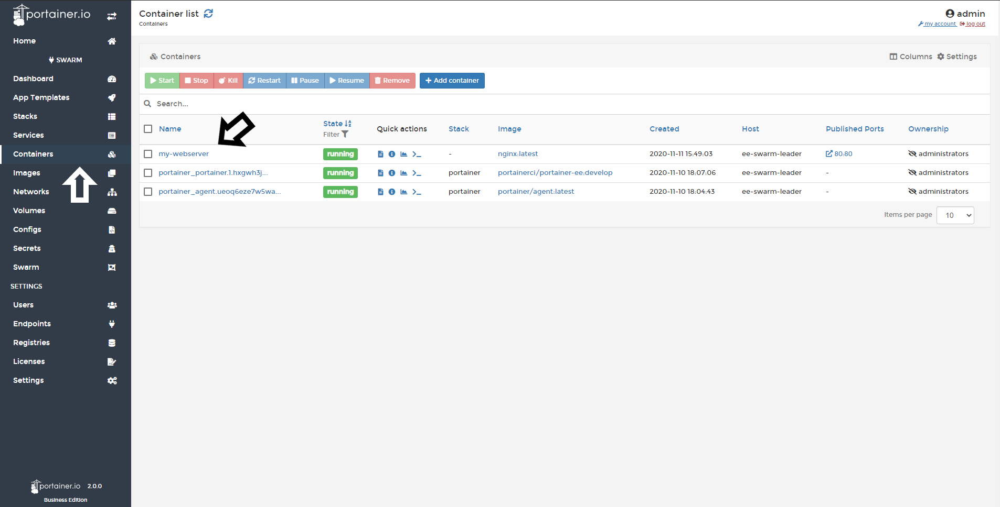
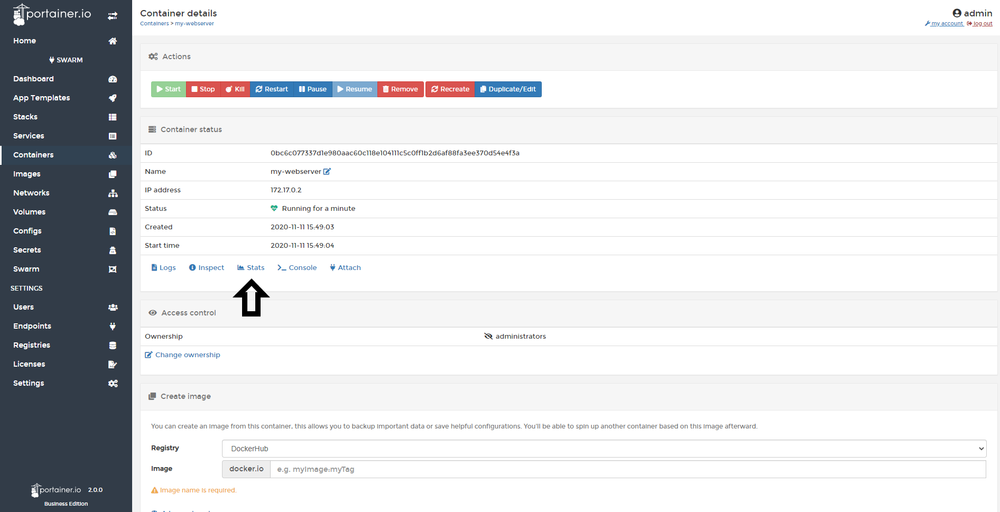

# View Container Stats

Stats are very important to understand the resource consumption of yours containers. In Portainer, you are able to monitor this from the UI. 

## Viewing Container Stats

First Click <b>Containers</b>, select the container you want to see the stats.

Then click <b>Stats</b>

Here, you can view a very comprehensive list of consumption stats:

* Memory Usage
* CPU Usage
* Network Usage: RX and TX
* Process running in the container
* Refresh Rate: You can configure time intervals to get new stats data.

## Notes

[Contribute to these docs](https://github.com/portainer/portainer-docs/blob/master/contributing.md).