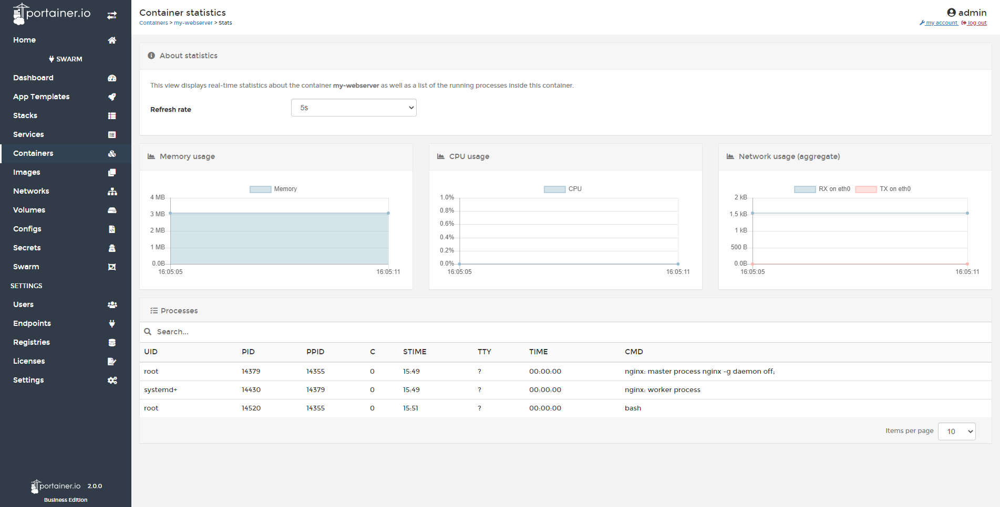

# View Container Stats

Stats are very important to understand the resource consumption of your containers. In Portainer, you are able to monitor this from the UI. 

## Viewing Container Stats

First click <b>Containers</b>, then select the container.

Then click <b>Stats</b>

Here, you can view a very comprehensive list of consumption stats:

* Memory Usage
* CPU Usage
* Network Usage: RX and TX
* I/O Usage
* Processes running in the container

You can also configure the refresh rate of the displayed stats from the dropdown box.

## :material-note-text: Notes

[Contribute to these docs](https://github.com/portainer/portainer-docs/blob/master/contributing.md){target=_blank}