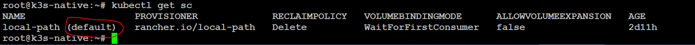

# :material-kubernetes: Deploying Portainer Business in Kubernetes
Portainer is comprised of two elements, the Portainer Server, and the Portainer Agent. Both elements run as lightweight containers on Kubernetes. There are many possible deployment scenarios, however, we have detailed the most common below. Please use the scenario that matches your configuration.

Regardless of your configuration, you will need:

* A working and up to date Kubernetes cluster
* Access to run Helm or kubectl commands on your cluster
* Cluster Admin rights on your Kubernetes cluster. This is so Portainer can create the necessary `#!Ruby ServiceAccount` and `#!Ruby ClusterRoleBinding` for it to access the Kubernetes cluster.
* A default StorageClass configured (see below)


By default, Portainer will expose the UI over port `#!Ruby 9000` and expose a TCP tunnel server over port `#!Ruby 8000`. The latter is optional and is only required if you plan to use the Edge compute features with Edge agents.


To learn more about the requirements please visit the [requirements](/v2.0-be/deploy/requirements/) page.

!!! Warning "Agent Versions"
    Always match the agent version to Portainer Server version. i.e., while installing or upgrading to Portainer 2.6 make sure all the agents are also version 2.6. 

!!! Warning "Access Control & RBAC"
    Kubernetes RBAC needs to enabled and working for Access Control to work properly in Portainer.

## :fontawesome-solid-paper-plane: Portainer Deployment
---
### :material-list-status: Pre-Req Note:
Portainer requires data persistence, and as a result needs at least one storage-class available to use. Portainer will attempt to use the "default" storage class during deployment. If you do NOT have a storage class tagged as "default" the deployment will likely fail.

You can check if you have a default storage class by running:

```shell
kubectl get sc
```

and looking for a storage class with (default) after its name:


```shell
kubectl patch storageclass <storage-class-name> -p '{"metadata": {"annotations":{"storageclass.kubernetes.io/is-default-class":"true"}}}'
```

and replace <storage-class-name> with the name of your storage class        
Example: `kubectl patch storageclass local-path -p '{"metadata": {"annotations":{"storageclass.kubernetes.io/is-default-class":"true"}}}'`

Alternatively, if installing using our helm chart you can add the following option with helm install:
```shell
--set persistence.storageClass=<storage-class-name>
```
---
<br>

**To deploy Portainer within a Kubernetes cluster, you can either use our HELM chart, or our provided manifests.**

=== "Deploy using Helm"
    !!! Abstract ""
        ### :fontawesome-solid-server: Portainer Server Deployment
        Ensure you're using at least Helm v3.2, which [includes support](https://github.com/helm/helm/pull/7648) for the `--create-namespace` argument.

        First, add the Portainer helm repo running the following:
        
        ```shell
        helm repo add portainer https://portainer.github.io/k8s/
        ```

        ```shell
        helm repo update
        ```
        
        Based on how you would like to expose the Portainer service, select an option below:
    
        === "NodePort"
            Using the following command, Portainer will be available on port 30777.

            ```shell
            helm install --create-namespace -n portainer portainer portainer/portainer \
            --set enterpriseEdition.enabled=true
            ```

        === "Ingress"
            Using the following command, the Portainer service will be assigned a Cluster IP. You should use this with an Ingress, see Chart Configuration Options for Ingress related options. 

            ```shell
            helm install --create-namespace -n portainer portainer portainer/portainer \
            --set enterpriseEdition.enabled=true \
            --set service.type=ClusterIP
            ```

            ??? Hint "Example Deployment with Nginx Ingress"
                
                ```shell
                helm install --create-namespace -n portainer portainer portainer/portainer \
                --set enterpriseEdition.enabled=true \
                --set service.type=ClusterIP \
                --set ingress.enabled=true \
                --set ingress.annotations.'kubernetes\.io/ingress\.class'=nginx \
                --set ingress.hosts[0].host=portainer.example.io \
                --set ingress.hosts[0].paths[0].path="/"
                ```
        
        === "LoadBalancer"
            Using the following command, Portainer will be available at an assigned LoadBalancer IP @ port 9000.
            ```shell
            helm install --create-namespace -n portainer portainer portainer/portainer \
            --set enterpriseEdition.enabled=true  \
            --set service.type=LoadBalancer
            ```
        ??? Note "Chart Configuration Options"

            The following table lists the configurable parameters of the Portainer chart and their default values. The values file can be found under `deploy/helm/portainer/values.yaml`.

            *The parameters will be keep updating.*

            | Parameter | Description | Default |
            | - | - | - |
            | `replicaCount` | Number of Portainer service replicas (ALWAYS set to 1) | `1` |
            | `image.repository` | Portainer Docker Hub repository | `portainer/portainer-ce` |
            | `image.tag` | Tag for the Portainer image | `latest` |
            | `image.pullPolicy` | Portainer image pulling policy | `IfNotPresent` |
            | `imagePullSecrets` | If Portainer image requires to be in a private repository | `nil` |
            | `nodeSelector` | Used to apply a nodeSelector to the deployment | `{}` |
            | `serviceAccount.annotations` | Annotations to add to the service account | `null` |
            | `serviceAccount.name` | The name of the service account to use | `portainer-sa-clusteradmin` |
            | `service.type` | Service Type for the main Portainer Service; ClusterIP, NodePort and LoadBalancer | `LoadBalancer` |
            | `service.httpPort` | HTTP port for accessing Portainer Web | `9000` |
            | `service.httpNodePort` | Static NodePort for accessing Portainer Web. Specify only if the type is NodePort | `30777` |
            | `service.edgePort` | TCP port for accessing Portainer Edge | `8000` |
            | `service.edgeNodePort` | Static NodePort for accessing Portainer Edge. Specify only if the type is NodePort | `30776` |
            | `service.annotations` | Annotations to add to the service | `{}` |
            | `ingress.enabled` | Create an ingress for Portainer | `false` |
            | `ingress.annotations` | Annotations to add to the ingress. For instane, `kubernetes.io/ingress.class: nginx` | `{}` |
            | `ingress.hosts.host` | URL for Portainer Web. For instance, `portainer.example.io` | `nil` |
            | `ingress.hosts.paths.path` | Path for the Portainer Web. | `/` |
            | `ingress.hosts.paths.port` | Port for the Portainer Web. | `9000` |
            | `ingress.tls` | TLS support on ingress. Must create a secret with TLS certificates in advance | `[]` |
            | `resources` | Portainer resource requests and limits | `{}` |
            | `persistence.enabled` | Whether to enable data persistence | `true` |
            | `persistence.existingClaim` | Name of an existing PVC to use for data persistence | `nil` |
            | `persistence.size` | Size of the PVC used for persistence | `10Gi` |
            | `persistence.annotations` | Annotations to apply to PVC used for persistence | `{}` |
            | `persistence.storageClass` | StorageClass to apply to PVC used for persistence | `default` |
            | `persistence.accessMode` | AccessMode for persistence | `ReadWriteOnce` |
            | `persistence.selector` | Selector for persistence | `nil` |
        
        ### :fontawesome-solid-laptop: Portainer Agent Only Deployment

        Helm charts for Agent Only Deployments will be available soon.
        In the meantime please head over to YAML Manifests tab.

=== "Deploy using YAML Manifests"
    !!! Abstract ""
        ### :fontawesome-solid-server: Portainer Server Deployment
        Based on how you would like to expose the Portainer Service, select an option below:

        === "NodePort"
            Using the following command, Portainer will be available on port 30777.

            ```shell
            kubectl apply -n portainer -f https://raw.githubusercontent.com/portainer/k8s/master/deploy/manifests/portainer/portainer-ee.yaml
            ```

        === "LoadBalancer"
            Using the following command, Portainer will be available at an assigned LoadBalancer IP @ port 9000.

            ```shell
            kubectl apply -n portainer -f https://raw.githubusercontent.com/portainer/k8s/master/deploy/manifests/portainer/portainer-lb-ee.yaml
            ```

        ### :fontawesome-solid-laptop: Portainer Agent Only Deployment
        Choose one of the tabs below based on how you would like to expose the agent.

        === "NodePort"
            Run the following command to deploy the Agent in your Kubernetes Cluster, agent will be available on port 30778.

            ```shell
            kubectl apply -n portainer -f https://downloads.portainer.io/portainer-agent-k8s-nodeport-ee.yaml
            ```

        === "LoadBalancer"
            Run the following command to deploy the Agent in your Kubernetes Cluster, agent will be available on LoadBalancer assigned IP @ port 9001

            ```shell
            kubectl apply -n portainer -f https://downloads.portainer.io/portainer-agent-k8s-lb-ee.yaml
            ```

=== "Deploy on Windows WSL / Docker Desktop"
    !!!Abstract ""
        You can deploy Portainer in a Kubernetes environment in Windows using Docker Desktop. 
        
        !!! Note
            This scenario is for testing purpose only.

        ### Enable Kubernetes in Docker Desktop

        To enable Kubernetes in Docker Desktop, you need to open the dashboard of Docker Desktop. Right click the Docker icon in the system tray and click "dashboard"

        

        Click Settings:

        

        1. Select Kubernetes 2. Select 'Enable Kubernetes' 3. Click 'Apply and Restart'. 

        

        After a few minutes, you will see that Kubernetes is running:

        

        ### :fontawesome-solid-server: Portainer Server Deployment

        Based on how you would like expose the Portainer Service, select an option below:

        === "NodePort"
            Using the following command, Portainer will be available on port 30777.

            ```shell
            kubectl apply -n portainer -f https://raw.githubusercontent.com/portainer/k8s/master/deploy/manifests/portainer/portainer-ee.yaml
            ```

        === "LoadBalancer"
            Using the following command, Portainer will be available at an assigned LoadBalancer IP @ port 9000.

            ```shell
            kubectl apply -n portainer -f https://raw.githubusercontent.com/portainer/k8s/master/deploy/manifests/portainer/portainer-lb-ee.yaml
            ```

        ### :fontawesome-solid-laptop: Portainer Agent Only Deployment
        Choose one of the tabs below based on how you would like to expose the agent.

        === "NodePort"
            Run the following command to deploy the Agent in your Kubernetes Cluster, agent will be available on port 30778.

            ```shell
            kubectl apply -n portainer -f https://downloads.portainer.io/portainer-agent-k8s-nodeport-ee.yaml
            ```

        === "LoadBalancer"
            Run the following command to deploy the Agent in your Kubernetes Cluster, agent will be available on LoadBalancer assigned IP @ port 9001

            ```shell
            kubectl apply -n portainer -f https://downloads.portainer.io/portainer-agent-k8s-lb-ee.yaml
            ```


---

???+ Tip "Regarding Persisting Data"
    The charts/manifests will create a persistent volume for storing Portainer data, using the default StorageClass.

    In some Kubernetes clusters (for example microk8s), the default StorageClass simply creates hostPath volumes, which are not explicitly tied to a particular node. In a multi-node cluster, this can create an issue when the pod is terminated and rescheduled on a different node, "leaving" all the persistent data behind and starting the pod with an "empty" volume.

    While this behaviour is inherently a limitation of using hostPath volumes, a suitable workaround is to use add a nodeSelector to the deployment, which effectively "pins" the Portainer pod to a particular node.

    The nodeSelector can be added in the following ways:

    1. Edit your own values.yaml and set the value of nodeSelector:

            nodeSelector: kubernetes.io/hostname: \<YOUR NODE NAME>

    2. Explicitly set the target node when deploying/updating the Helm chart on the CLI, by including `--set nodeSelector.kubernetes.io/hostname=<YOUR NODE NAME>`
    
    3. If you've deployed Portainer via manifests, without Helm, run the following one-liner to "patch" the deployment, forcing the pod to always be scheduled on the node it's currently running on:

            kubectl patch deployments -n portainer portainer -p '{"spec": {"template": {"spec": {"nodeSelector": {"kubernetes.io/hostname": "'$(kubectl get pods -n portainer -o jsonpath='{ ..nodeName }')'"}}}}}' || (echo Failed to identify current node of portainer pod; exit 1)    
<br>
## :material-note-text: Notes

[Contribute to these docs](https://github.com/portainer/portainer-docs/blob/master/contributing.md){target=_blank}

<!-- {{ snippet('https://github.com/portainer/k8s.git', 'charts/portainer/README.md', '# Chart Configuration') }} -->