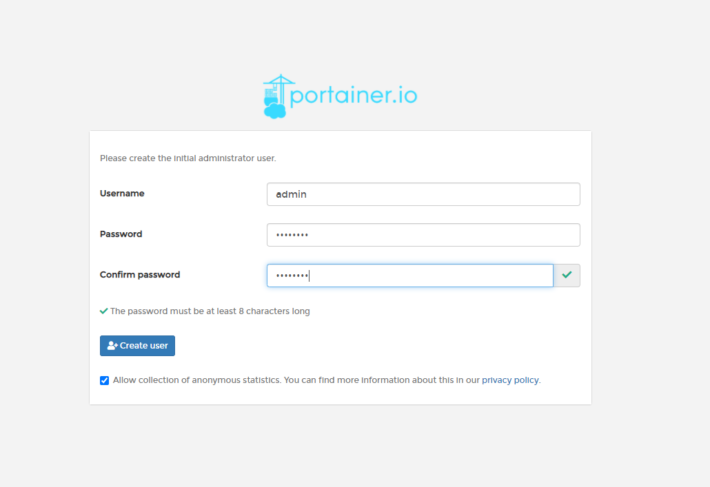
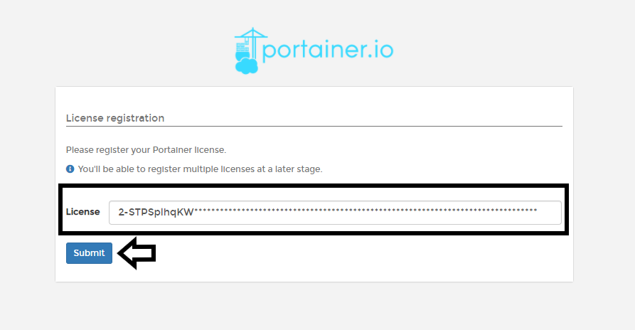
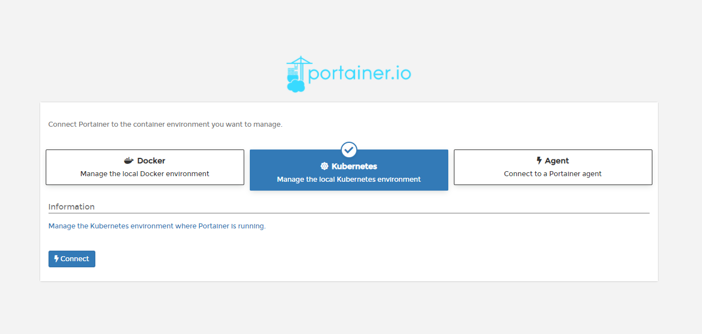
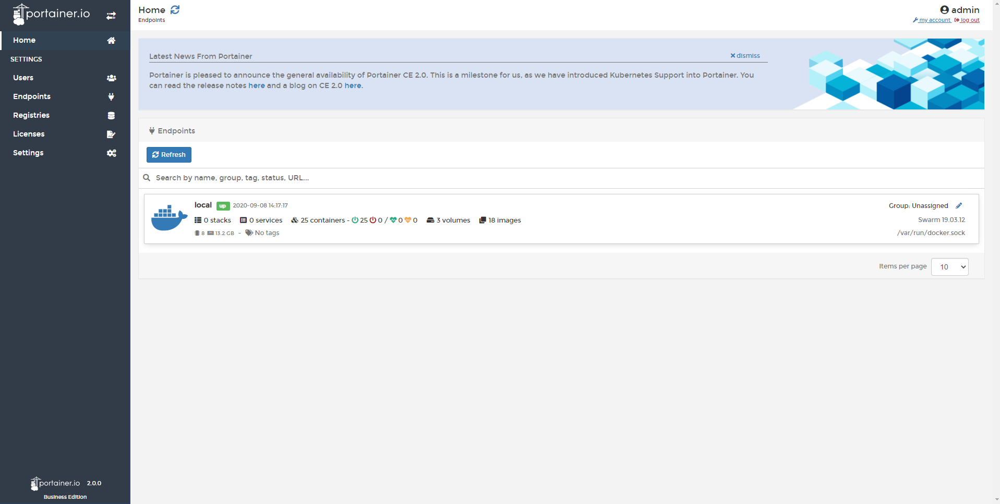

# Initial Set Up

Once Portainer is deployed and you have navigated to http://ip-server:9000, you will see the following screens. 

## Set Password Admin

The first thing to do is set a password for the admin user. This password needs to be at least eight characters long.

## Collection of statistics

We anonymously collect information about how Portainer is used via a tool called Matomo. You can disable this option, but we recommend leaving it activated. This will help us understand how our users use Portainer and improve it.

You can read more about our privacy policy [here](https://www.portainer.io/documentation/in-app-analytics-and-privacy-policy/)

You can enable or disable this using the checkbox shown:

This can be changed at any time via the Portainer Settings screen

## License Registration

In order to activate Portainer Business Edition, you need to provide a Portainer Business Edition valid license.

Enter the license and do a click in <b>Submit</b>.

If you need to add more licenses, you can do it later from the menu, click in the options <b>Licenses</b>.

If everything work as expected, the next step is connect Portainer to the initial endpoint.

## Connect Portainer to the container environment

If you installed [Portainer in Kubernetes](/v2.0-be/deploy/linux/#deploy-portainer-in-kubernetes) you would choose Kubernetes, but if you [installed in Docker](/v2.0-be/deploy/linux/#deploy-portainer-in-docker), you may want choose manage the local Docker environment. 

Once the appropriate option is selected, click connect. If everything works as expected, You will then be shown the Portainer home page.

## Notes

[Contribute to these docs](https://github.com/portainer/portainer-docs/blob/master/contributing.md).