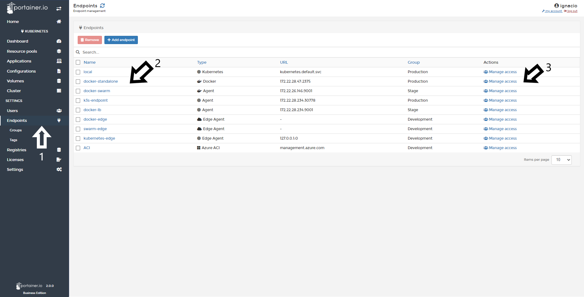
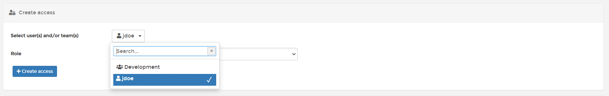
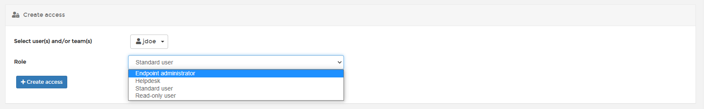
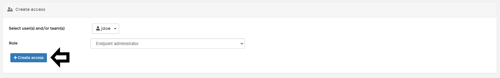

# Manage Endpoint Access

Portainer can manage endpoint  access. Depending on your needs, this can be broad or granular. Teams and/or users can be added to manage an Endpoint.

Access tagged as inherited relies on the group access rules. They cannot be removed or modified at the endpoint level but they can be overridden.

Access tagged as override are overriding the group access for the related users/teams.

## Adding a Team or User

To Add access to a Team or User click in <b>Endpoints</b>, Select the desired Endpoint, and click in <b>Manage 
Access</b>.

Next select the team or user you want to give access to one by one.

Once the team or user is selected click in dropdown menu <b>Role</b> and select the role you want to add to this user:

 <b>Create Access</b>

If everything work as expected, you will see the next pop up at the top right of your screen.

## Notes

[Contribute to these docs](https://github.com/portainer/portainer-docs/blob/master/contributing.md).