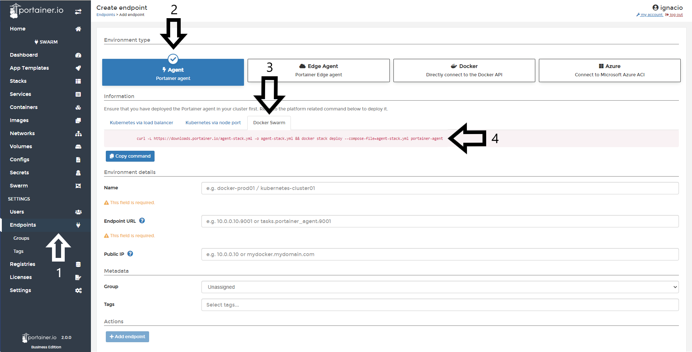
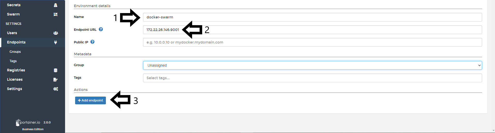
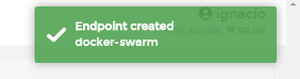
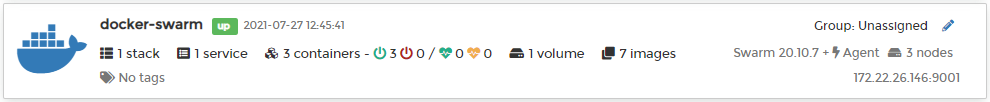

# Add a Docker Swarm Endpoint

Add a Docker Swarm Endpoint is very straighforward in Portainer. 

## Deploy the Agent.

Once logged into Portainer, go to <b>Endpoints</b> and select <b>Agent</b> as the <b>Environment Type</b>.

In the tabbed section below titled <b>Information</b>, select <b>Docker Swarm</b> and copy the command.   
Note: It is important run the command on the Docker Swarm host before adding the endpoint in Portainer to ensure the configuration is set up correctly. 

Use this same command each time you want to add a new Docker Swarm endpoint:

<pre><code>curl -L https://downloads.portainer.io/agent-stack.yml -o agent-stack.yml && docker stack deploy --compose-file=agent-stack.yml portainer-agent</code></pre>

The command will output something similar to:

<pre><code>  % Total    % Received % Xferd  Average Speed   Time    Time     Time  Current
                                 Dload  Upload   Total   Spent    Left  Speed
100   484  100   484    0     0    249      0  0:00:01  0:00:01 --:--:--   249
Creating network portainer-agent_portainer_agent
Creating service portainer-agent_agent</code></pre>

To validate the Portainer Agent is running, you can run the following command:

<pre><code> docker service ls</code></pre>

which should respond with something like this:

<pre><code>ID                  NAME                    MODE                REPLICAS            IMAGE                    PORTS
tshb6ee2710s        portainer-agent_agent   global              1/1                 portainer/agent:latest</code></pre>

Now, we're ready to move on to the next step.

## Finishing the configuration

Once the Agent is running on the Docker Swarm host, you need to fill in the <b>environment details</b>. The following options are available:

* Name: This is a descriptive name for your endpoint. This field is required.
* Endpoint URL: Define your IP or name to connect to the endpoint (Docker Swarm Host) and specify the port (9001) if this is needed. This field is required.
* Public IP: URL or IP address where exposed containers will be reachable. This field is optional and will default to the endpoint URL if not defined.

In the <b>Metadata</b> section, you can define a <b>group</b> and <b>tags</b> for this endpoint.

See the following screenshot for reference. 

When everything is set, you can click <b>Add Endpoint</b>. If successful, you will see this pop up at the top right corner:

and you will be able to see your new endpoint in the list on the home page:

## :material-note-text: Notes

[Contribute to these docs](https://github.com/portainer/portainer-docs/blob/master/contributing.md){target=_blank}