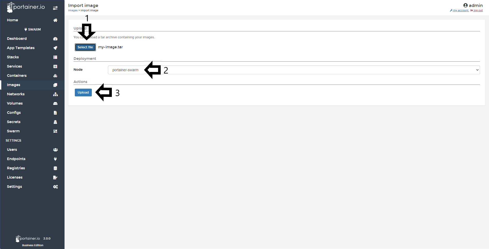

# Import Images

Portainer allows you to import the images that you have created in another Portainer instance or in the CLI of Docker and Docker Swarm.

!!! note
    On a multi-node environment, the image you import will only be available on the node you choose under Deployment. If you wish to make the image available to all nodes, consider [adding a registry](/v2.0-be/registries/connect/) to Portainer.
## Importing Images

To import an image using Portainer, go to <b>Images</b> and then click <b>Import</b>.

Select your <b>image</b>, select the <b>node</b> where you will save the image and click <b>Upload</b>.

Once the images have uploaded, you will see the following pop up:

## :material-note-text: Notes

[Contribute to these docs](https://github.com/portainer/portainer-docs/blob/master/contributing.md){target=_blank}