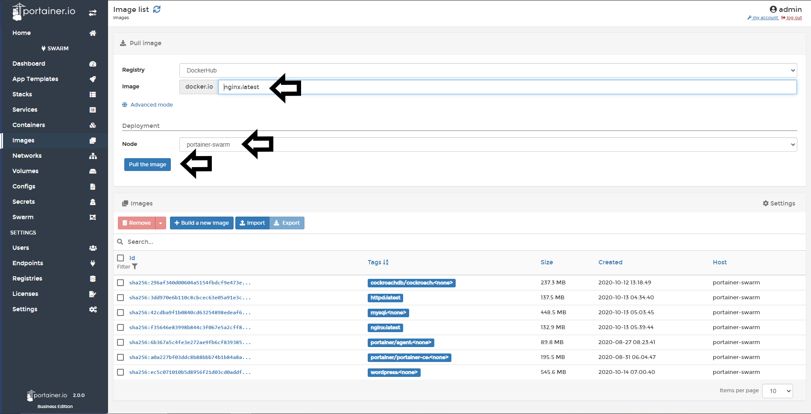
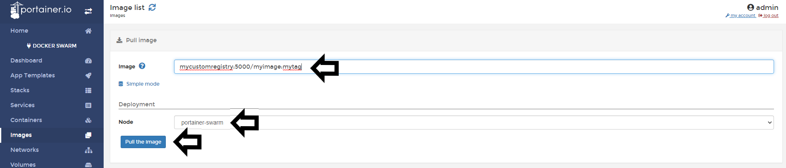

# Pull Images

You can pull images from any registry already added to Portainer, see how to [add new registries](/v2.0-be/registries/connect/) to Portainer for more information. This option is currently only available, when you manage Docker and Docker Swarm environments.

## Pulling Images

### Pulling in Simple Mode

To pull images from Docker Hub or another registry that you have connected before you must do the following:
Go to <b>Images</b> and then type the <b>name</b> of the image, select the <b>node</b> that will download the image and click <b>Pull the Image</b>.

When the image is sucessfully downloaded, you will see a pop up at the right top corner.

### Pulling in Advanced Mode

Using <b>Advanced Mode</b> you can define a <b>custom registry URL</b>, <b>port</b> and <b>image</b>. This use case is ideal when you run your own private registry.

To pull images, go to <b>Images</b> click in <b>Advanced Mode</b> and then, define your <b>registry</b>, <b>port</b>, <b>image</b>, and specify the <b>node</b> where the image is going to be downloaded and click <b>Pull the Image</b>

You will see an animation in the button while the imeage is downloading:

When the image is sucessful downloaded, you will see a pop up at the right top corner.

## :material-note-text: Notes

[Contribute to these docs](https://github.com/portainer/portainer-docs/blob/master/contributing.md){target=_blank}
