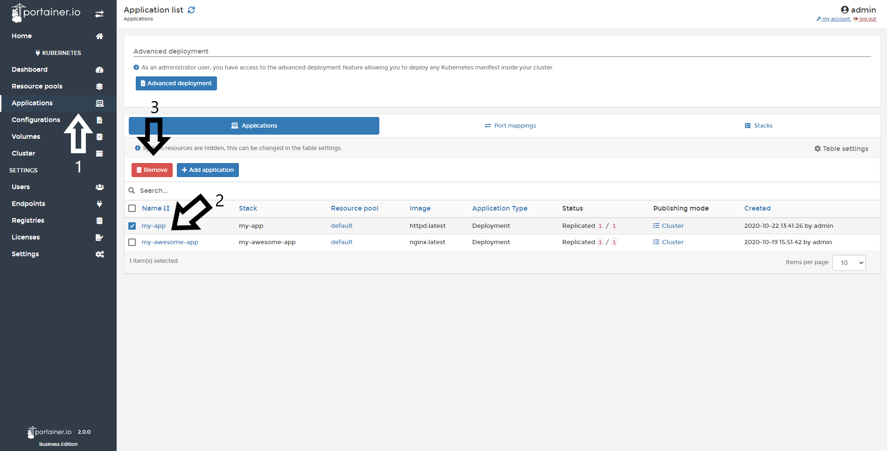

# Delete an Application

You can remove/delete applications using the Portainer GUI.

## Deleting an Application

To delete an Application, click <b>Applications</b>, select the Application you want to delete and then click <b>Remove</b>.

## Notes

[Contribute to these docs](https://github.com/portainer/portainer-docs/blob/master/contributing.md).