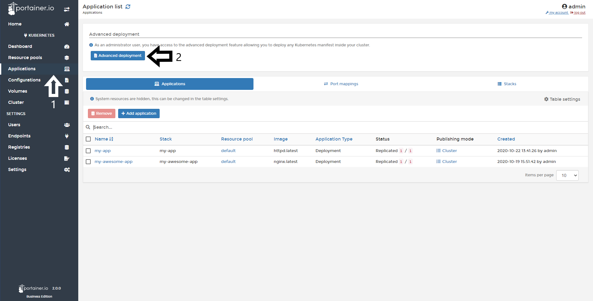
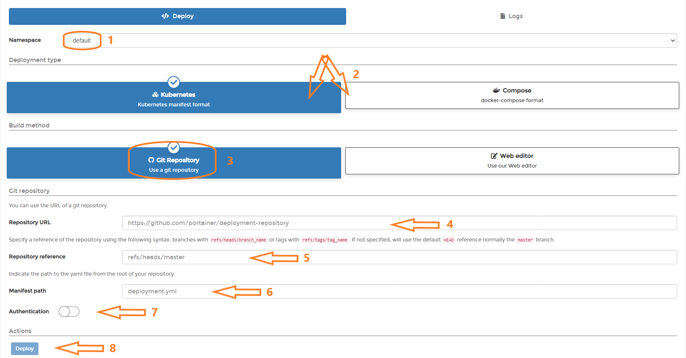

# Deploy an App from a manifest

In Portainer you can launch new applications using your current manifest in YML for K8s or convert from a docker-compose file format. 

<b>Note</b>: Portainer uses Kompose to convert your Compose manifest to a Kubernetes compliant manifest. Be wary that not all the Compose format options are supported by Kompose at the moment.

## Deploying an App from a Kubernetes Manifest.

To start, click <b>Applications</b> and then <b>Advanced Deployment</b>.

Here you have the option to use a manifest file that is in a git repo or enter the YAML manifest using the web editor.

### Manifest from git

Select the Namespace to deploy the application to, Select Kubernetes or Compose based on the format of your manifest. Select **Git Repository**, enter the details for your git repo. Toggle on and enter Authentication details if required for the repo. Finally, Click **Deploy**.

If everything works as expected you will see this pop up:

### Manifest using Web editor

In this section, you need to define the Namespace/Resource Pool where your applications are going to be deployed and start to write or paste your Kubernetes Manifest. Once this is done, click <b>Deploy</b>.

If everything works as expected you will see this pop up:

## :material-note-text: Notes

[Contribute to these docs](https://github.com/portainer/portainer-docs/blob/master/contributing.md){target=_blank}