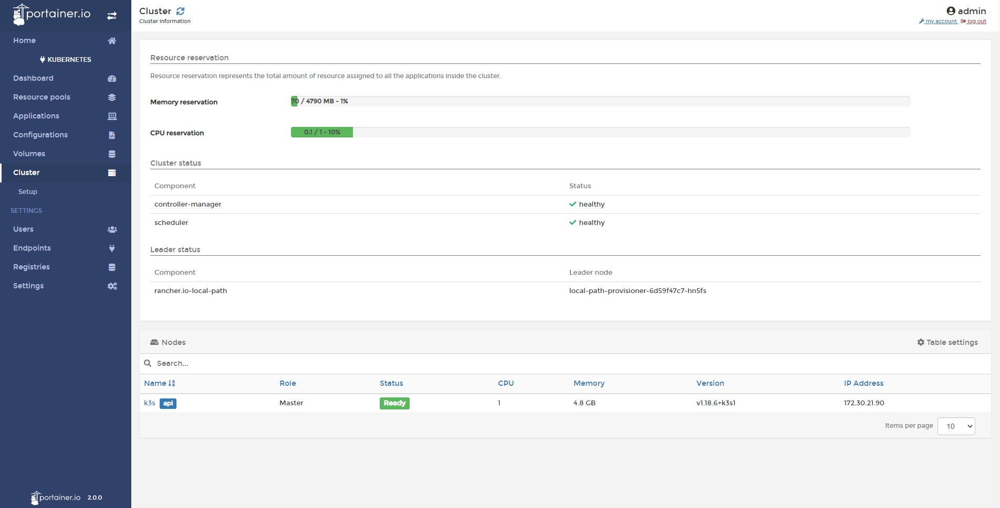
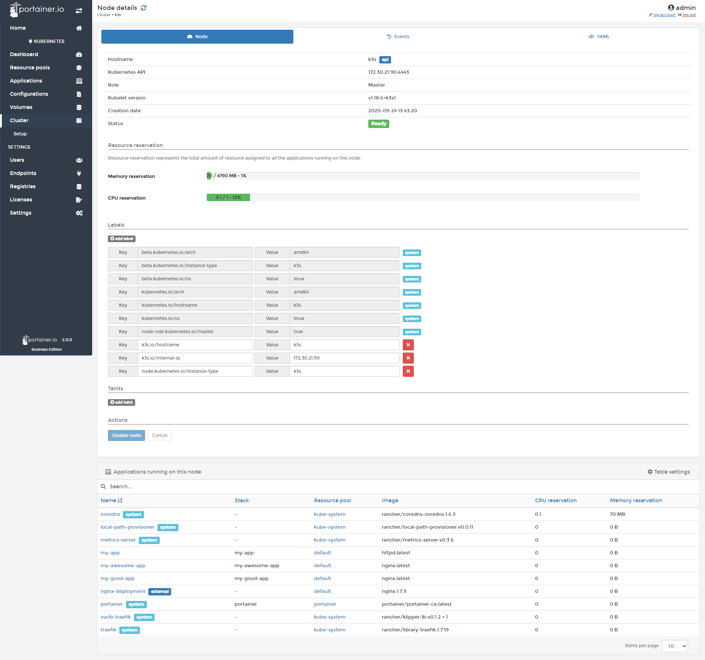
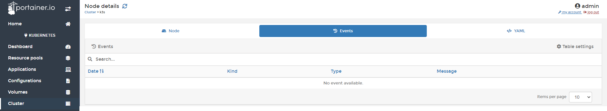
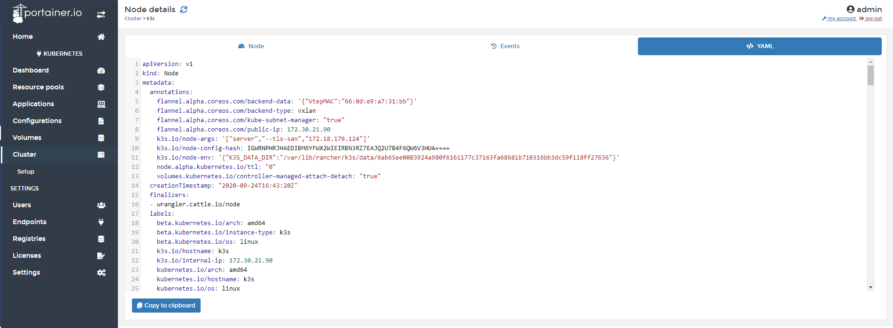

# Inspect the Cluster

From Portainer, you can inspect Kubernetes Clusters.

## Inspecting the cluster

Click <b>Cluster</b> and you will see information about this cluster. 

* Memory Reservation: Memory used and available for this cluster.
* CPU Reservation: How much CPU reserved is used. 
* Client Satus: View if the components are healthy or they have some any issues.
* Leader Status: You will see if this node is a Leader or not.

At the bottom of the page, you will see information about the nodes that are part of this cluster. 

Name, Role, CPU, Memory, Version of Kubernetes, IP Address.

## Inspecting nodes

### Node

When you click in a node, you can inspect it. You will find the following information:

* Hostname
* Kubernetes API Por
* Role
* Kubelet Version
* Creation date
* Status
* Labels
* Applications running on this node

### Events

In the events tab, you will see information about the events related to your node. 

### YAML

Here you will find the configuration of your node in YAML format. You can copy the content and save it to mantain a backup of the node configuration.

## Notes

[Contribute to these docs](https://github.com/portainer/portainer-docs/blob/master/contributing.md).