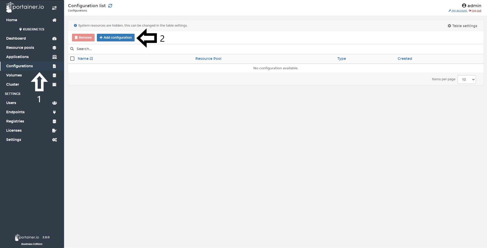
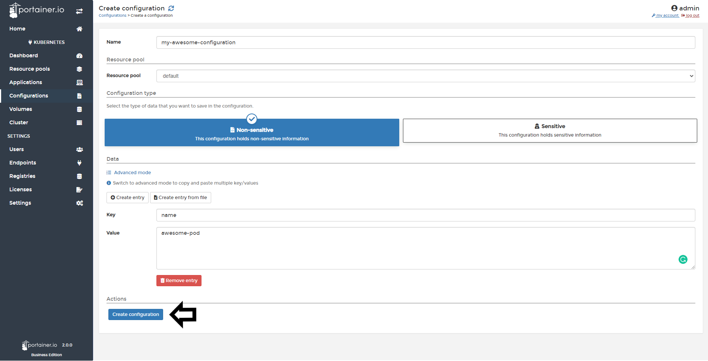

# Create a configuration

From Portainer you can create Configurations files outside a service’s image or running containers. This allows you to keep your images as generic as possible, without the need to bind-mount configuration files into the containers or use environment variables.

## Creating a configuration

To create a configuration, click <b>Configurations</b> and then click <b>Add configuration</b>.

In the next screen, you need to define the following:

* Name: Name your configuration.
* Resource Pool: Where the configuration is going to be saved.
* Configuration Type:
  - Non-sensitive: This configuration holds non-sensitive information.
  - Sensitive: This configuration holds sensitive information like passwords or certificates

In the data section, clicking <b>Advanced Mode</b> allows you to define your configuration in YAML format. If you would prefer not to use advanced mode, you can create entries using the fields below or taking from a file. 

Once you have set your configuration, click <b>Create configuration</b>

## Notes

[Contribute to these docs](https://github.com/portainer/portainer-docs/blob/master/contributing.md).