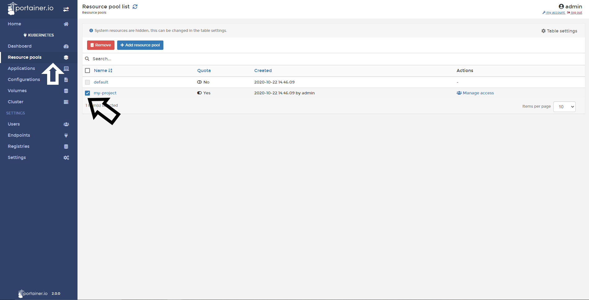
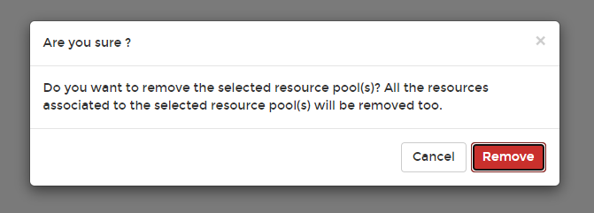

# Delete/Remove a Namespace/Resource Pool

When you have finished your project, you can delete Namespaces/resource pools to free up resources.

## Removing a Resouce Pool

Click <b>Namespaces/Resouce Pools</b>, select the Namespacesresource pool and click <b>Remove</b>.

You need to confirm this action:

If everything works as expected, you will see a pop up confirming your action.

## :material-note-text: Notes

[Contribute to these docs](https://github.com/portainer/portainer-docs/blob/master/contributing.md){target=_blank}