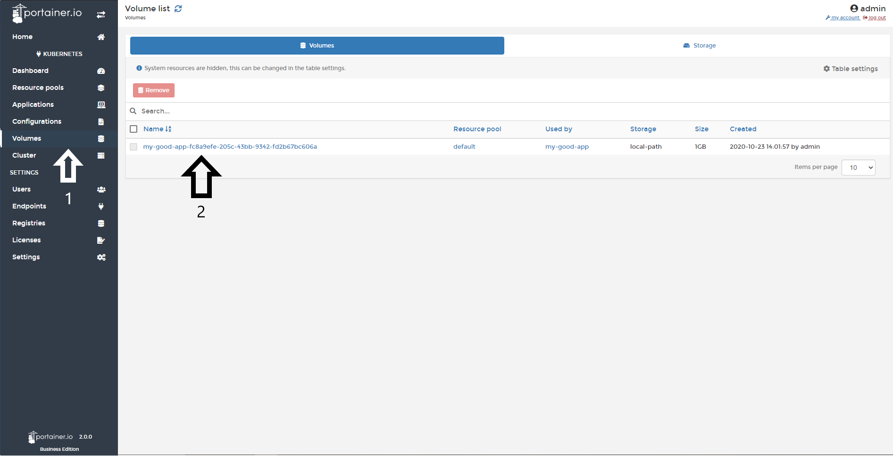
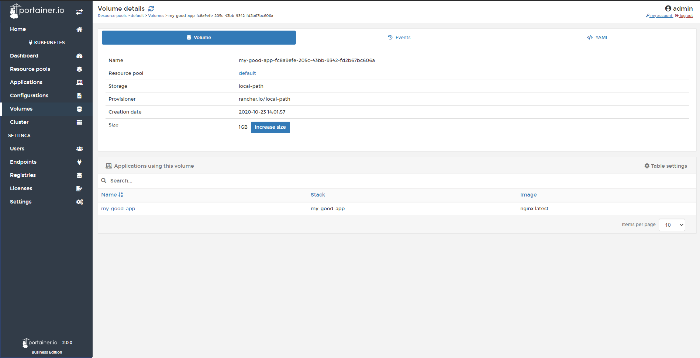
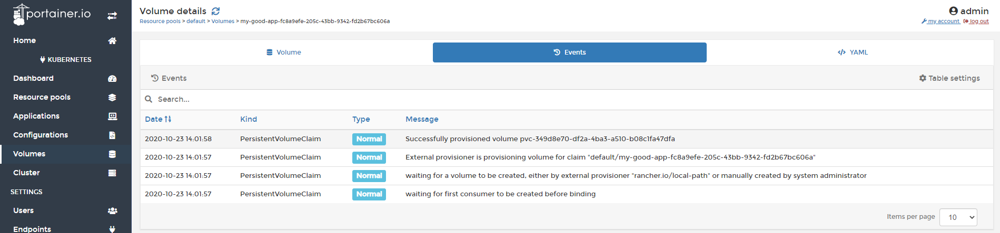
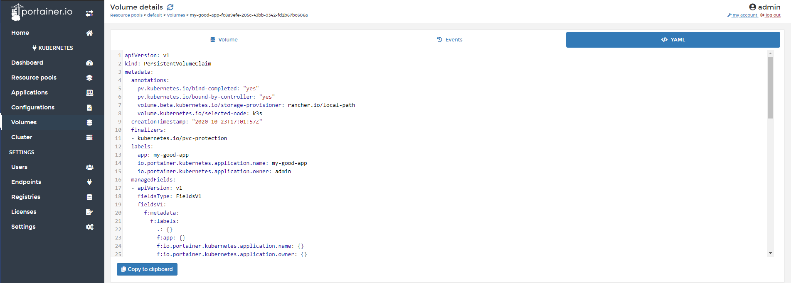

# Inspect a volume

In Portainer, you can inspect volumes that you mounted in a Kubernetes Pod.

## Inspecting a Volume

Go to <b>Volumes</b> and then choose the volume you want inspect.

In the first view, you will see the following data:

* Resource pool where this volume was saved
* Used By: Name of the app that is using the volume
* Storage: What is the storage
* Size  
* Created: Information about who and when it was created.

After selecting the volume, you will see three tabs. In the first one, you will information about the volume itself.

In the <b>events</b> tab you will see the events related to this volume:

And the YAML tab you will see the configuration of this volume in YAML format. From this tab, you can copy and save the content as a backup.

## :material-note-text: Notes

[Contribute to these docs](https://github.com/portainer/portainer-docs/blob/master/contributing.md){target=_blank}