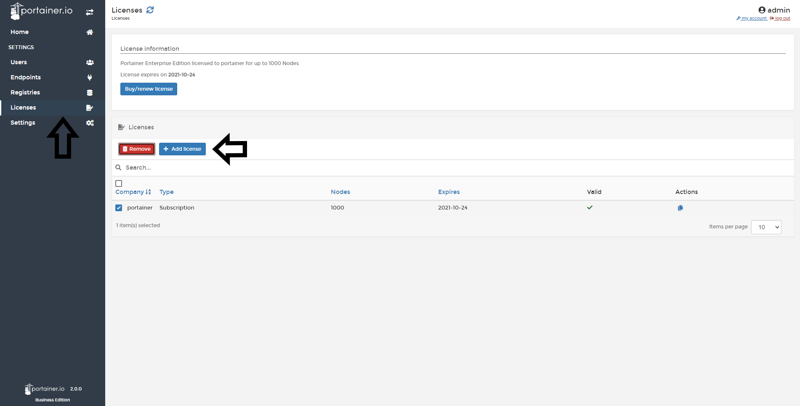
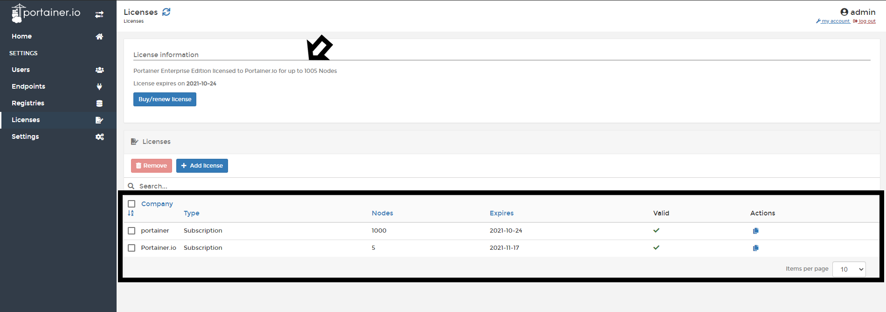
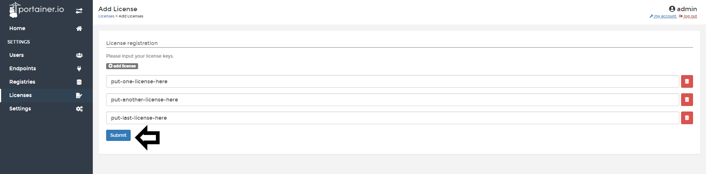
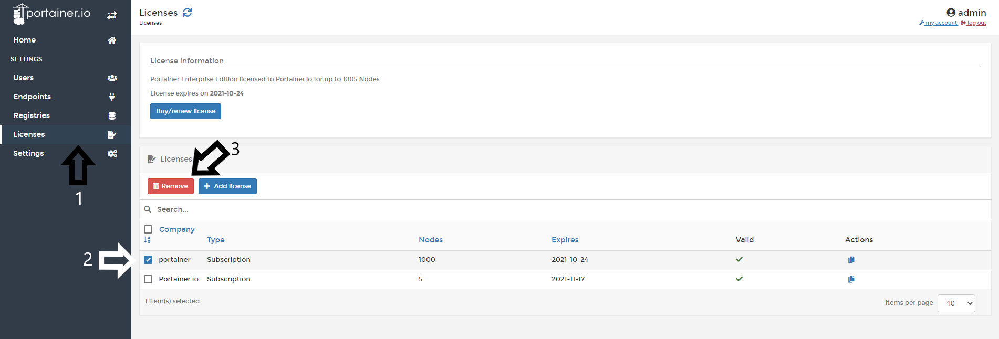
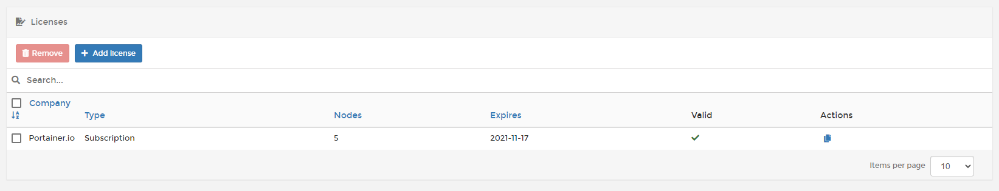

# Add a Business Edition License

If you add more nodes to your environment and want to manage with Portainer Business Edition, you need to upgrade your license to fit the numbers of nodes. Once you have the right license for the quantity of nodes, you need to add this license in Portainer Configuration.

## Adding / Upgrading a Business Edition License

To add new licenses to your current instance of Portainer, go to <b>Licenses</b> and click <b>Add license</b>

Add your new license and click <b>Submit</b>.

If everything goes well, you will see your quantity of nodes licensed increases and your new license added.

## Adding multiple licenses

If you buy more than one license, you can add it in a single process. Go to <b>Add License</b> and click <b>Add License</b>.

When all the licenses are entered, click <b>Summit</b>

## Removing a License

<b>Note</b>: If you have a single license installed in your Portainer instance, you cannot remove the license because at least one is needed.

To remove a license, go to <b>Licenses</b>, select the license you want to remove and click <b>Remove</b>.

You will ask for confirmation. If you're sure, click <b>Remove</b>.

And you're done, you have removed the license.

## :material-note-text: Notes

[Contribute to these docs](https://github.com/portainer/portainer-docs/blob/master/contributing.md){target=_blank}