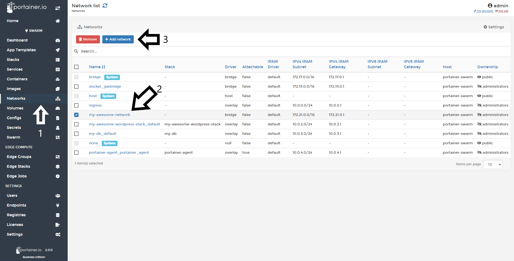

# Delete a Network

Portainer allows you to delete networks. 

## Deleting Networks

To delete a network, click <b>Networks</b>, select the <b>network</b> you want to delete, and click <b>Remove</b>.

## :material-note-text: Notes

[Contribute to these docs](https://github.com/portainer/portainer-docs/blob/master/contributing.md){target=_blank}