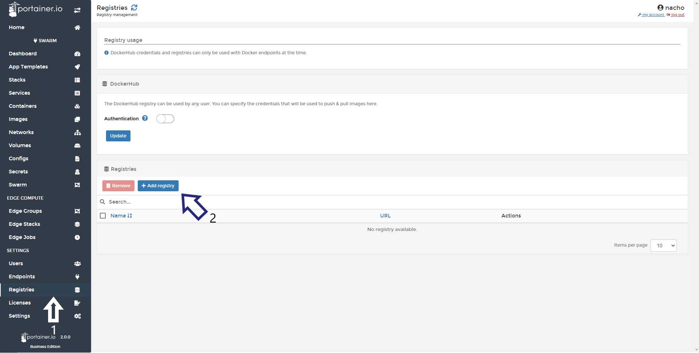
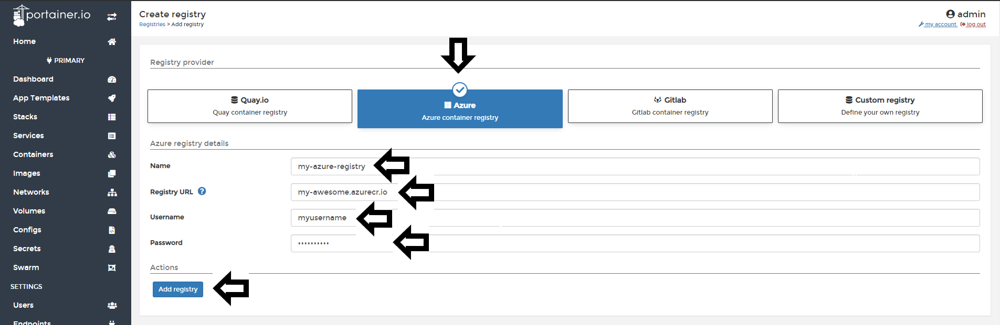
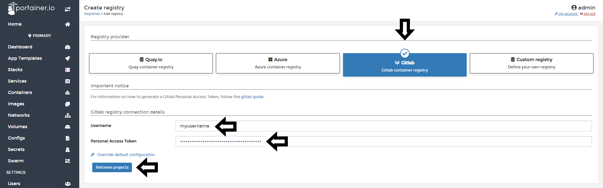
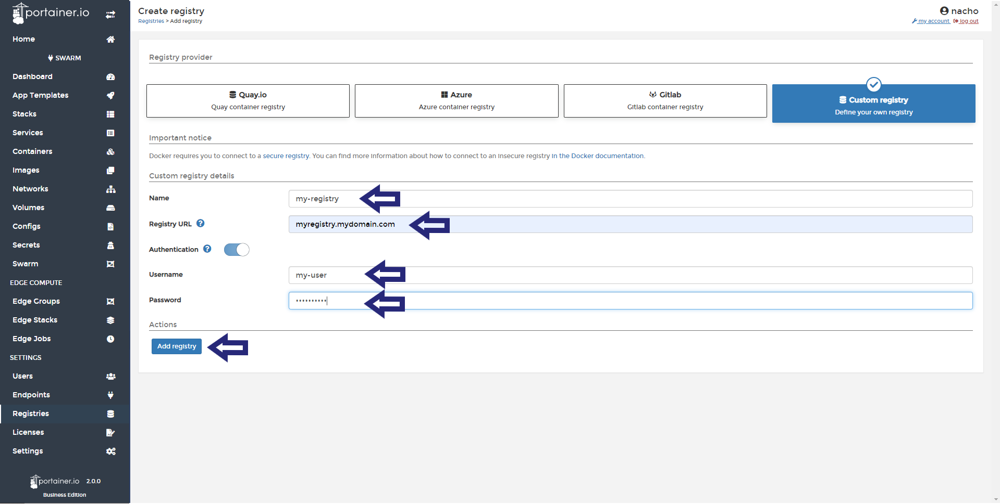
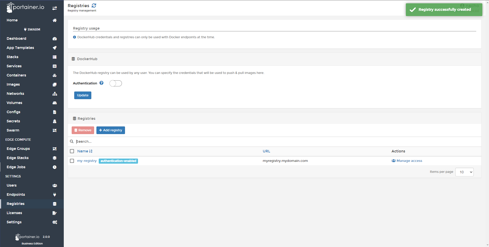

# Add / Connect a new registry

Portainer can connect to many of the well-known registries including Quay.io, Azure Container Registry, Gitlab Container Registry, and a Custom Registry.
## Quay.io

To connect to a Quay registry, go to <b>Registries</b> and then <b>Add Registry</b>

In the next screen, choose <b>Quay.io</b> and enter your <b>Username</b> and <b>Password</b>, then click <b>Add registry</b>.

## Azure Container Registry

To connect to a Azure registry, go to <b>Registries</b> and then <b>Add Registry</b>

In the next screen, choose <b>Azure</b>, name your registry, enter the <b>Registry URL</b>, <b>Username</b>, and <b>Password</b>, then click <b>Add registry</b>.

## Gitlab

To connect to a Gitlab registry, go to <b>Registries</b> and then <b>Add Registry</b>

In the next screen, choose <b>Gitlab</b>, enter the <b>Username</b>, and <b>Personal Token</b>, then <b>Add registry</b>.

<b>Note</b>: For information on how to generate a Gitlab Personal Access Token, follow the [Gitlab guide](https://gitlab.com/help/user/profile/personal_access_tokens.md).

## How to add a Custom Registry

Portainer can connect to custom or 3rd party registries. First select <b>Custom Registry</b> and enter the details there.

The required fields are <b>name</b> of the registry and <b>address</b>, if any authentication is required, you must enable the <b>authentication</b> toggle and add your login details.

Once all the details are entered, click <b>Add Registry</b>. If successful you will see the following:

## Notes

[Contribute to these docs](https://github.com/portainer/portainer-docs/blob/master/contributing.md).