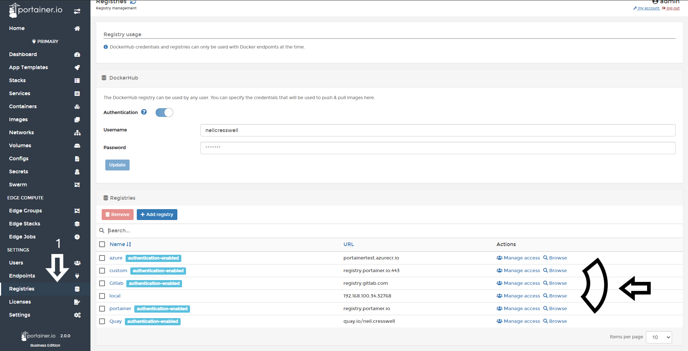
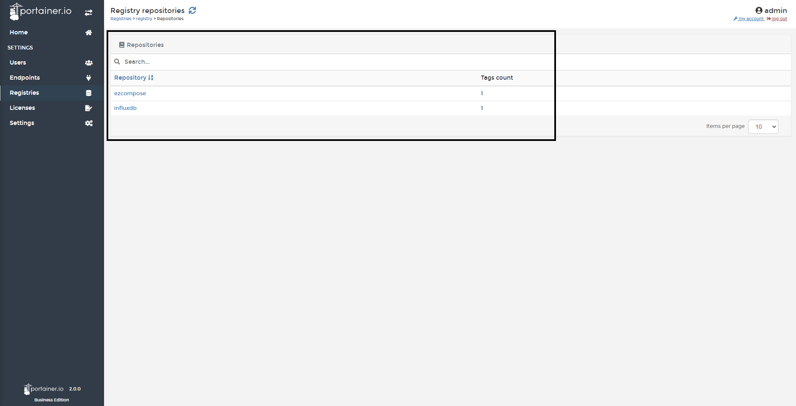
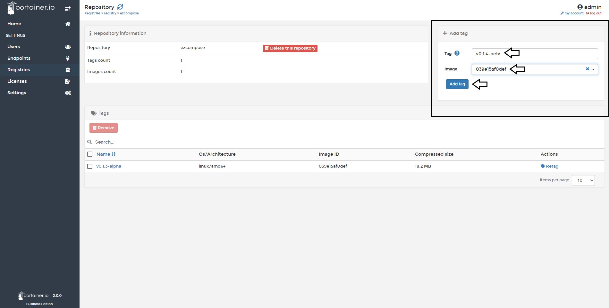
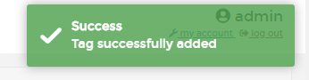
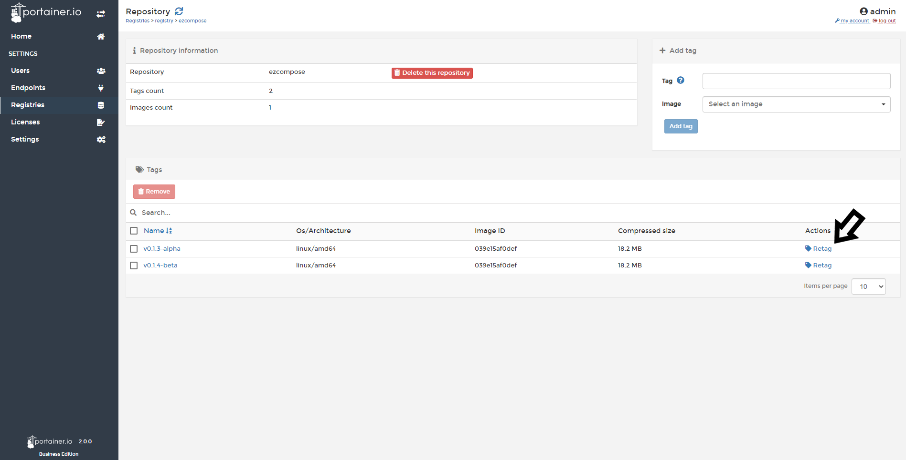
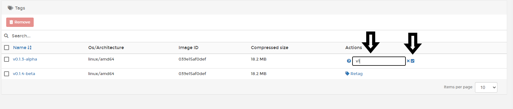
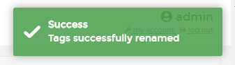
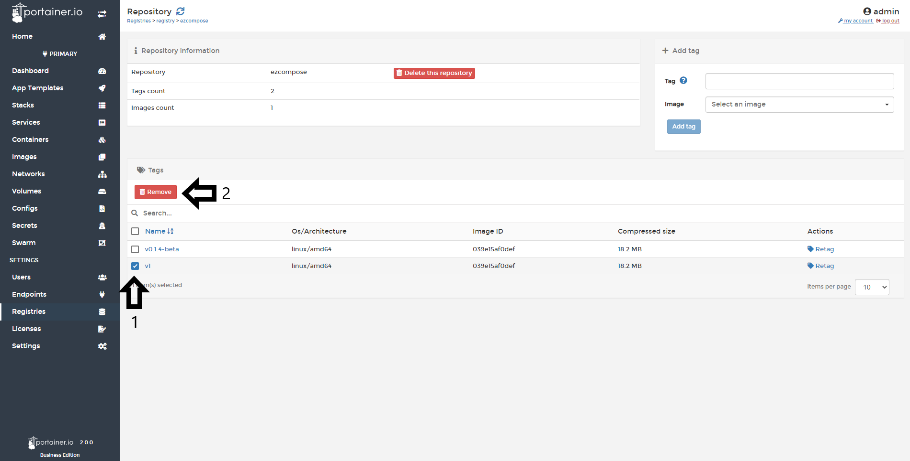
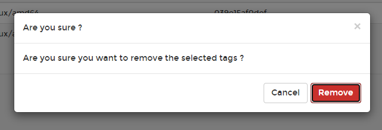
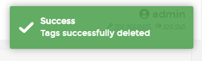

# Manage a Registry

From Portainer Business Edition, you can manage Registries and Repositories. 

## Managing a Repository

### Add a Tag

Adding a tag to an image hosted in the registry is an easy task with Portainer, it doesn't require type any commands in the CLI.

Go to <b>Registries</b>, choose the registry you want to manage and click <b>browse</b>.

After that, you will see the repositories saved in that registry. Select the one you want to manage.

The next step is to look at the top right of the screen, you will see a box with the section name <b>Add tag</b>, you only need write the name of the tag, select the image and click <b>Add tag</b>.

If everything work as expected, you will see a pop up at the right top corner.

### Retag

<b>Note</b>: If you have hosted your own Docker registry, you need to add a specific environment variable to enable retag and deleting. The env is <code>REGISTRY_STORAGE_DELETE_ENABLED=TRUE</code>.

Another capability of Portainer Business Edition is Retagging the current images saved in a repository. To do this, you need to go to <b>Registries</b>, choose the registry you want to manage and click <b>browse</b>.

After that, you will see the repositories saved in that registry. Select the image you want to Retag.

After that, click <b>Retag</b>.

Type the new tag for this image and click the <b>✔</b>

If everything work as expected, you will see a pop-up confirming the action.

### Remove a Tag

<b>Note</b>: If you have hosted your own Docker registry, you need to add a specific environment variable to enable retag and deleting. The env is <code>REGISTRY_STORAGE_DELETE_ENABLED=TRUE</code>.

You can remove a tag from Portainer Business Edition. To do this, you need to go to <b>Registries</b>, choose the registry you want to manage and click <b>browse</b>.

After that, you will see the repositories saved in that registry. Select the image you want to Remove.

Select the image/tag and click <b>Remove</b>.

You will be asked for confirmation, if you're sure, click <b>Remove</b>.

If everything works as expected, you will see a pop-up confirming the action.

# Notes

[Contribute to these docs](https://github.com/portainer/portainer-docs/blob/master/contributing.md).