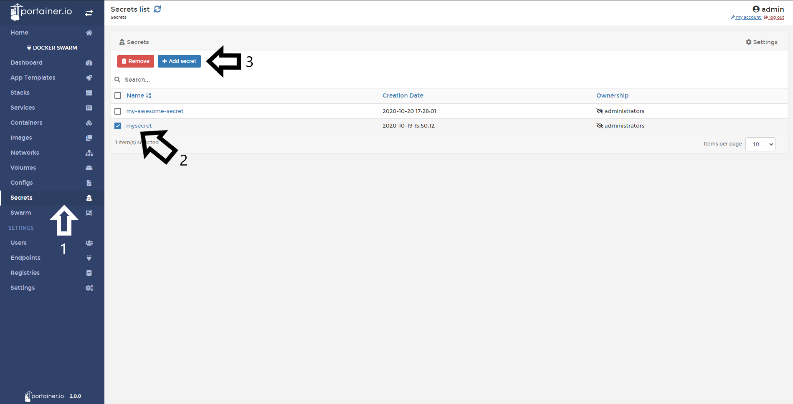

# Delete a Secret

It is good practice to delete the secrets that you don't need anymore.

## Deleting a Secret

To delete a secret, go to <b>Secrets</b>, select the secret you want delete and then, click <b>Remove</b>.

## :material-note-text: Notes

[Contribute to these docs](https://github.com/portainer/portainer-docs/blob/master/contributing.md){target=_blank}