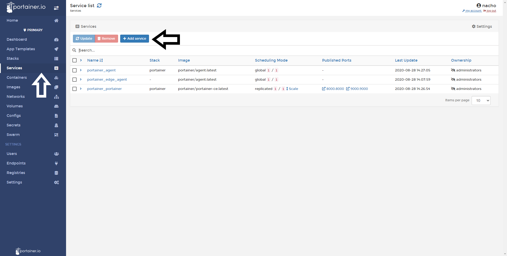
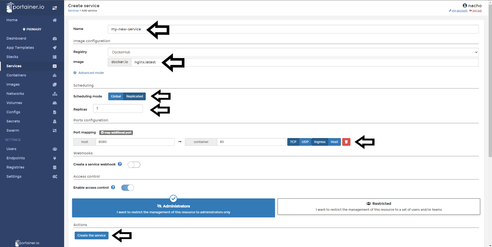
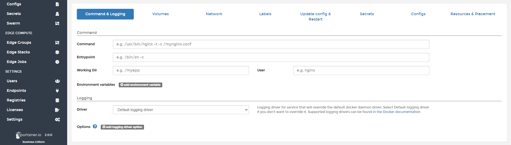
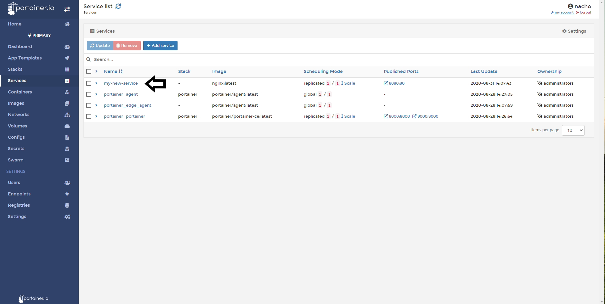

# How to Create a new service

Services are collections of containers. In this example, ee're going to deploy an NGINX Web Server.

<b>Note</b>: This article only covers Docker Swarm environments at present. 

## Creating a new service

Click <b>Services</b> from the side menu and then <b>Add Service</b>.

Complete the fields:

* Name: Choose a name for the service

* Registry & Image: Select where these are located

* Replicated or Global: Replicated in the same host or deployed Globally with one container in each host

* Ports: define the ports to expose for that service

Further settings are available on this screen, once these have been set appropriately, click <b>Create The Service</b>.

If successful, your service will be listed in the table of services.

## Notes

[Contribute to these docs](https://github.com/portainer/portainer-docs/blob/master/contributing.md).