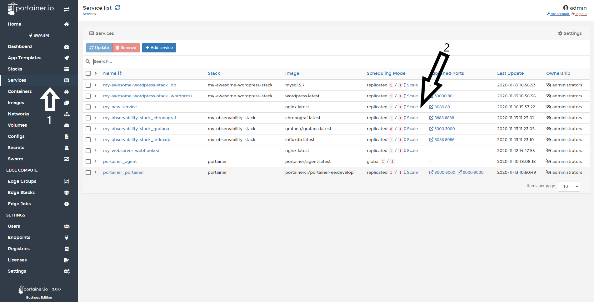
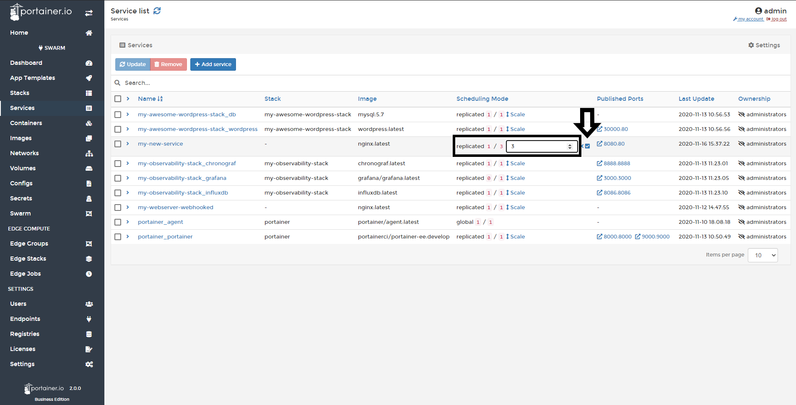
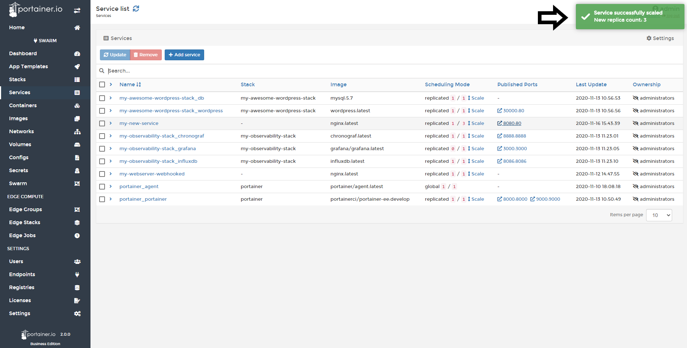
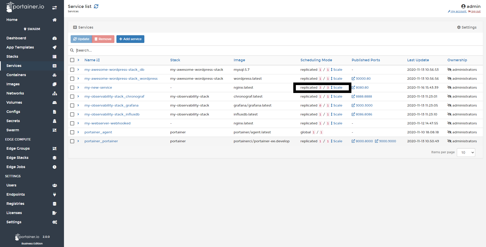

# How to scale a service

This is a powerful feature that allows you to scale your services horizontally.

## Scaling a Service

Click <b>Services</b> and then Click <b>scale</b>.

Enter the number of replicas you want for this service and click the <b>check box</b>.

If successful you will see the green pop up at the top right of screen. 

Refreshing this page will show you the replicas (3 in this case) running, depending on the size of the containers, you may have a slight delay in seeing this.

## Notes

[Contribute to these docs](https://github.com/portainer/portainer-docs/blob/master/contributing.md).