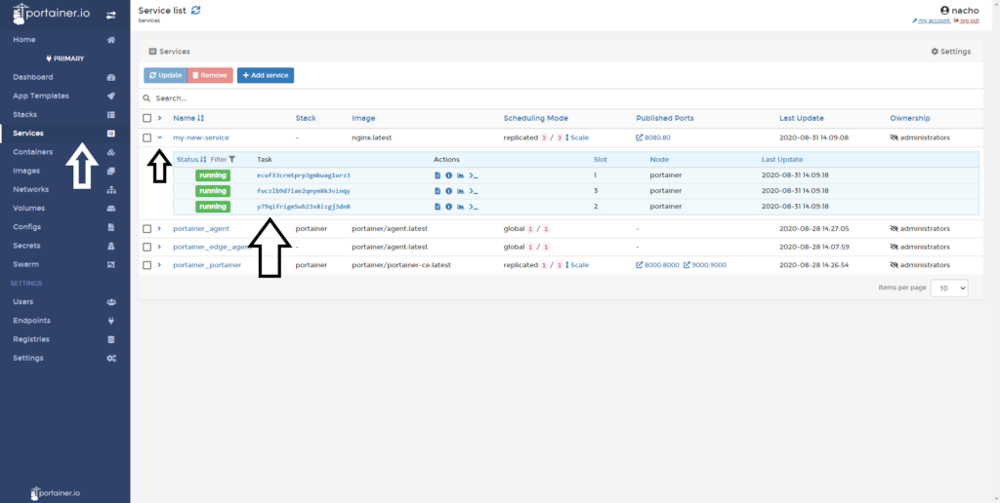

# Service task status

Services in a Docker Swarm environment are a collection of tasks (or individuals containers). Portainer allows you to very quickly see the status of the containers are part of a service.

## Viewing the task of the services

Click <b>Services</b>, and then click the dropwdown arrow to the left of the service you want to inspect.

This shows the tasks that make up this service. In this example, you can see three running containers that make up the Docker Swarm service.

## Notes

[Contribute to these docs](https://github.com/portainer/portainer-docs/blob/master/contributing.md).