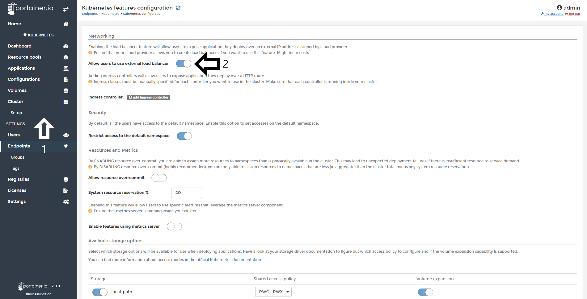

# Enable external Load Balancer usage

Enabling the load balancer feature will allow users to expose applications they deploy over an external IP address assigned by Cloud provider.

<b>Note</b>: Ensure that your cloud provider allows you to create load balancers if you want to use this feature. Might incur costs.

## Enabling usage of External Balancer

To do this, you need to open Portainer Business Edition, go to <b>Cluster</b> and the to <b>Setup</b>. After that, you need to enable the toggle <b>Allow users to use external load balancer</b>.

After you enabled the toggle, scroll down and do a click in <b>Save Configuration</b>.

Starting now, when you create a resource pool, you can define an external load balancer quota. 

## Notes

[Contribute to these docs](https://github.com/portainer/portainer-docs/blob/master/contributing.md).