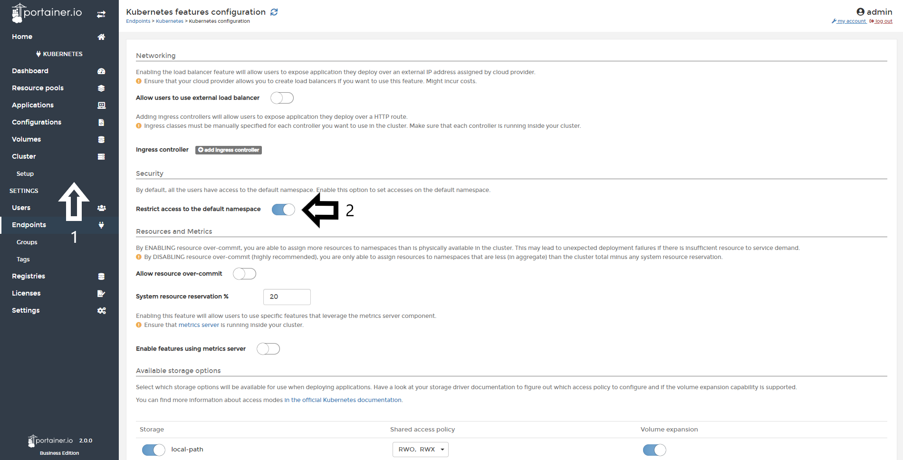

# Limit usage of "default" Kubernetes Namespace (Kubernetes Only)

By default, a Kubernetes cluster will instantiate a default namespace when provisioning the cluster to hold the default set of Pods, Services, and Deployments used by the cluster but for an any reason, you want to limitate the usage of that namespace, with Portainer Business Edition, you can do it. 

## Limiting the usage of "default" namespace

To do this, you need to open Portainer Business Edition, go to <b>Cluster</b> and the to <b>Setup</b>. After that, you need to enable the toggle <b>Restrict access to the default namespace</b>.

After you enabled the toggle, scroll down and click <b>Save Configuration</b>.

Starting now, the only user with the power to run applications in the default namespace is the Administrator of Portainer. 

## :material-note-text: Notes

[Contribute to these docs](https://github.com/portainer/portainer-docs/blob/master/contributing.md){target=_blank}