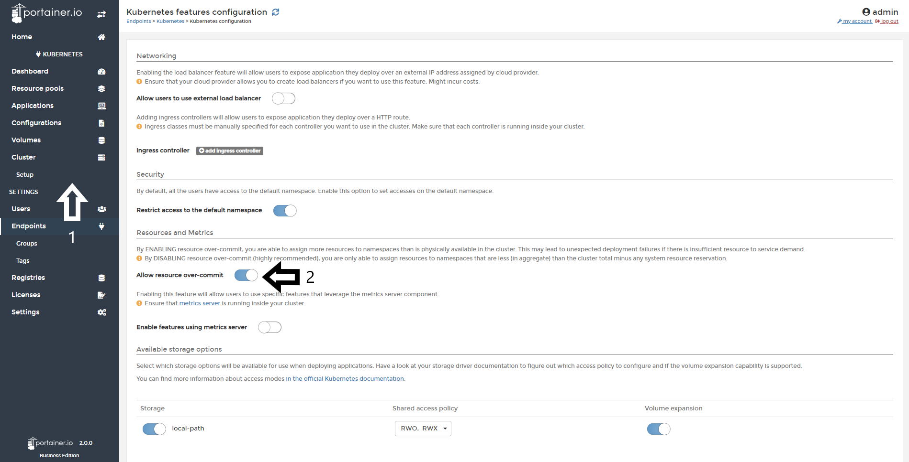
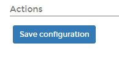
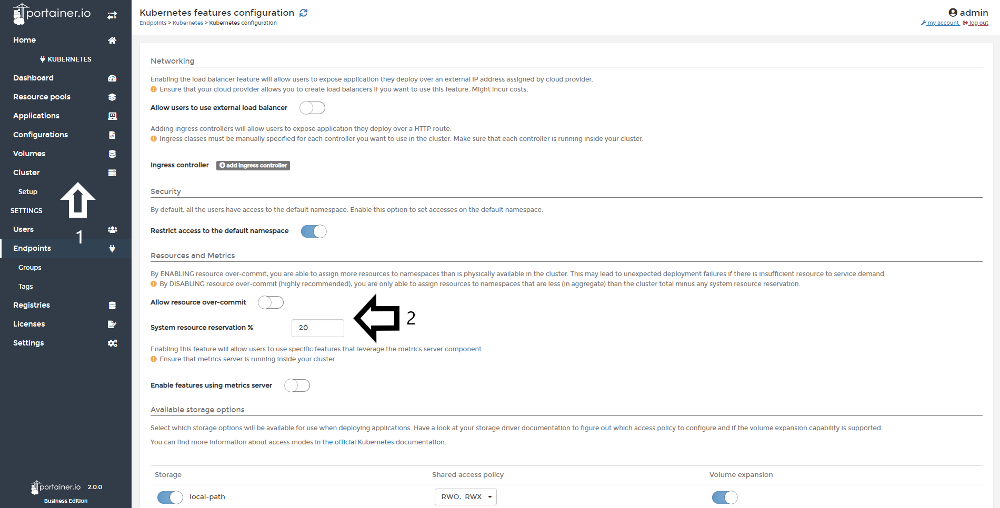

# Over Commitment of Resources (Kubernetes Only)

With Portainer Business Edition, you can use your resources on full where are most needed. You can configure more resources to namespaces than is physically available in the cluster.

<b>Important</b>: By ENABLING resource over-commit, you are able to assign more resources to namespaces than is physically available in the cluster. This may lead to unexpected deployment failures if there is insufficient resources to service demand. By DISABLING resource over-commit (highly recommended), you are only able to assign resources to namespaces that are less (in aggregate) than the cluster total minus any system resource reservation.

## Enabling Over Commitment of Resources

To do this, you need to open Portainer Business Edition, go to <b>Cluster</b> and then to <b>Setup</b>. After that, you need to enable the toggle <b>Allow resource over-commit</b>.

After you enabled the toggle, scroll down and click <b>Save Configuration</b>.

## Disabling Over Commitment of Resources

When you disable the Over Commitment of resources, you can reserve a system resource reservation percentage. To do this, you need to open Portainer Business Edition, go to <b>Cluster</b> and then to <b>Setup</b>. After that, you need to disable the toggle <b>Allow resource over-commit</b>, you cam then do a reservation of resources. Insert the percentage of the resources you want to reserve...

After you disabled the toggle, scroll down and click <b>Save Configuration</b>.

## Notes

[Contribute to these docs](https://github.com/portainer/portainer-docs/blob/master/contributing.md).