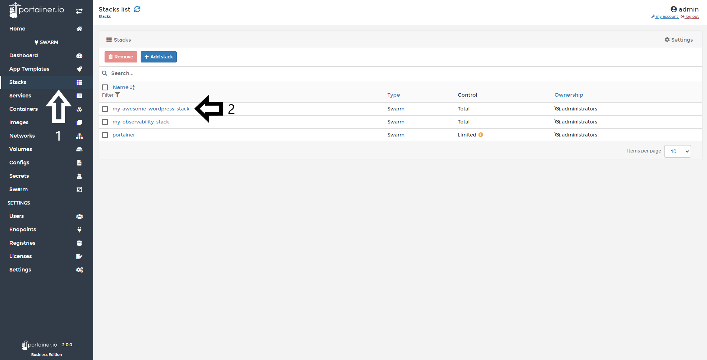
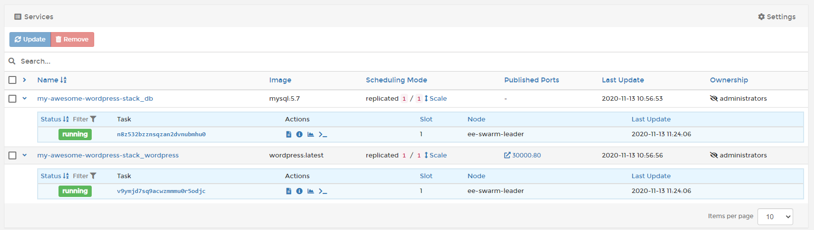
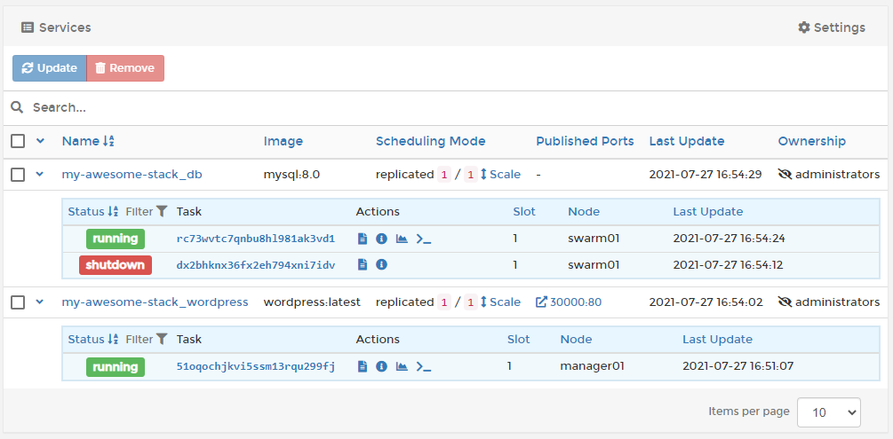

# Edit/Inspect a Stack

In Portainer, you can inspect your stacks to see what is running or access to their logs and stats, as well as make changes to a stack you have already deployed. 

## Inspecting a Stack

To inspect the tasks associated to your stack, select <b>Stacks</b> and then select the stack you want to inspect.

Here you can:

* Stop, delete or create a template from this stack
* Edit the stack YML directly
* If the stack was deployed from a Git repository, you can redeploy the stack using an updated compose file from the Git repository
* [Duplicate or migrate the stack](/v2.0-be/stacks/duplicate_migration/)

* View what services that make up the stack, and whether they are running or stopped
* How many replicas running in each host
* Access the service logs
* Inspect the task stats
* Access the container console

## :material-note-text: Notes

[Contribute to these docs](https://github.com/portainer/portainer-docs/blob/master/contributing.md){target=_blank}