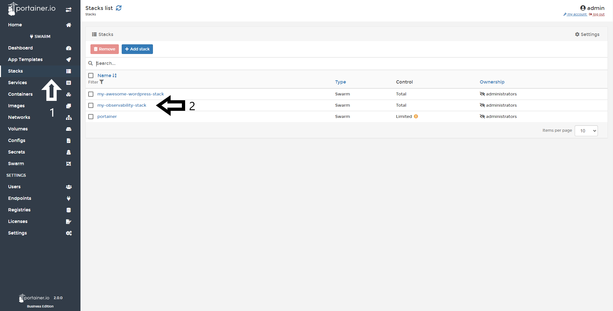
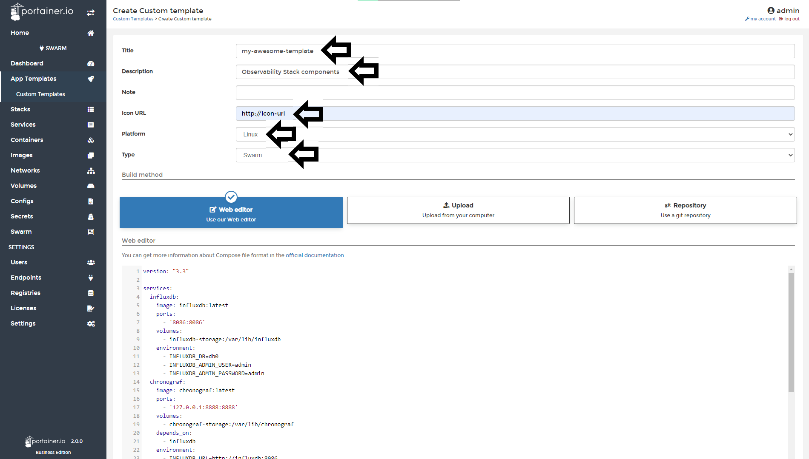
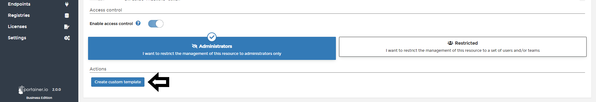

# Create a template from a deployed Stack

In Portainer, you can create an App template from deployed Stacks. This is really useful when you need to deploy the same stack several times. 

## How to creating a Template from a Stack

Select <b>Stacks</b> and select the desired and already deployed stack.

Then click <b>Create Template from stack</b>.

Now define some properties for this new template:

* Title: Name your new template.
* Description: Short description about your template.
* Notes: You can write notes about this template.
* Icon URL: You can set up a icon from a URL
* Platform: Here, you need to define if your template is ready for use in Linux or Windows environments. 
* Type: Choose between Swarm and Docker Standalone.

You can also upload another compose file from your computer or a Github repository if needed. 

Once this has been defined, you can add more services to your template.

Once complete click <b>create custom template</b>.

## :material-note-text: Notes

[Contribute to these docs](https://github.com/portainer/portainer-docs/blob/master/contributing.md){target=_blank}