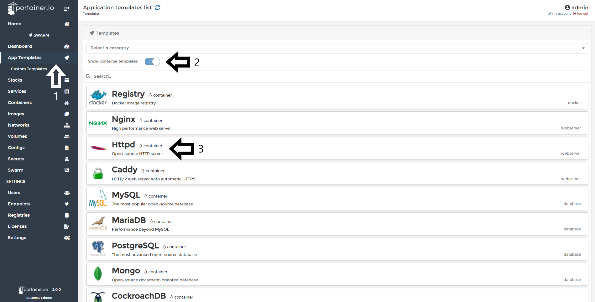
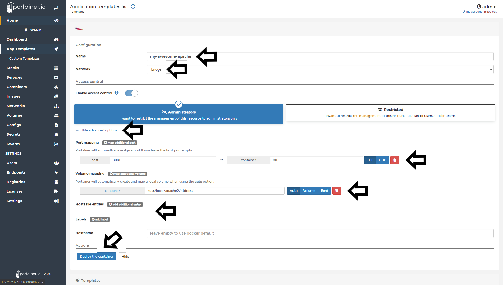
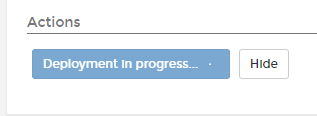

# Deploy a standalone app (Container)

From Portainer, you can deploy a standalone app from the default template list.

## Deploying an standalone app

To deploy a standalone container from the templates, you need to go to <b>App Templates</b>, enable the toggle <b>Show container templates</b> and pick the app you want to deploy. For this example, we will deploy an Apache Web Server.

After that, define a <b>name</b>, <b>network</b>, <b>access control</b> if needed, <b>port mapping</b>, <b>volumes</b> and when all is set, do a click in <b>Deploy the Container</b>.

You will see an animation in the button while the container is deploying:

If everything work as expected, you will see a pop up confirming that the container was deployed.

## Notes

[Contribute to these docs](https://github.com/portainer/portainer-docs/blob/master/contributing.md).