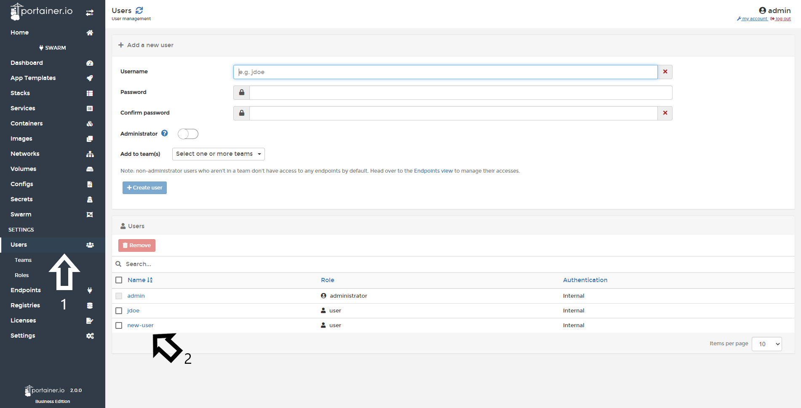
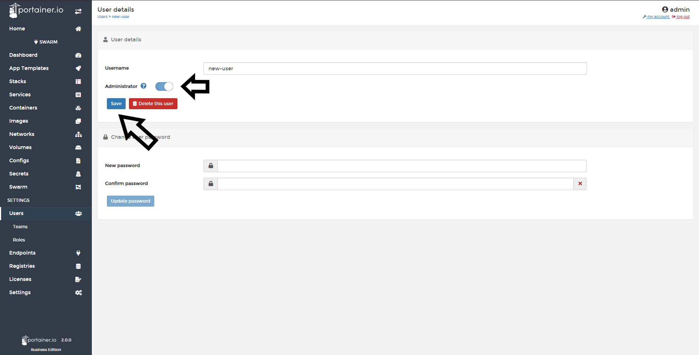
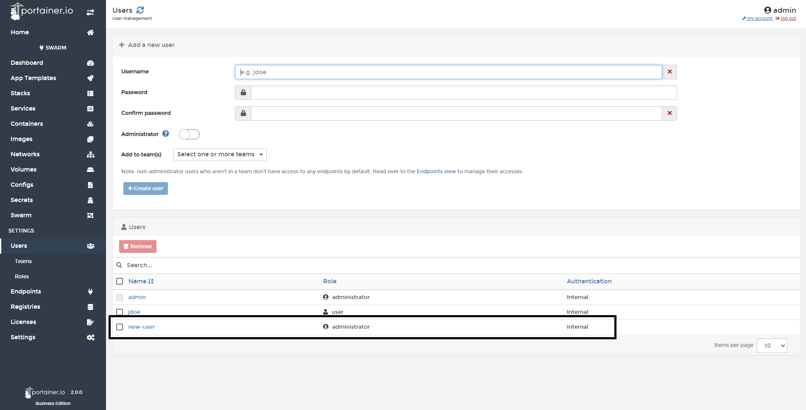

# How to promote a regular user to administrator

First click <b>Users</b> and select the user you want to promote.

Enable the toggle <b>Administrator</b> in the next screen and click <b>Save</b>.

Confirmation appears at the top right of screen.

The user list now shows the selected user with the administrator role. 

#Notes

[Contribute to these docs](https://github.com/portainer/portainer-docs/blob/master/contributing.md){target=_blank}