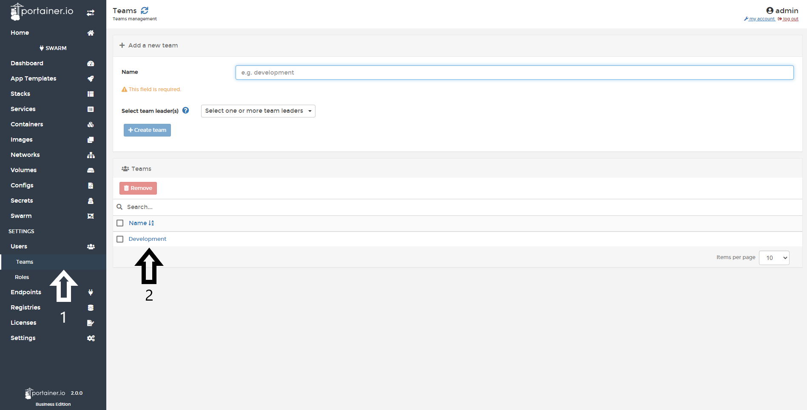
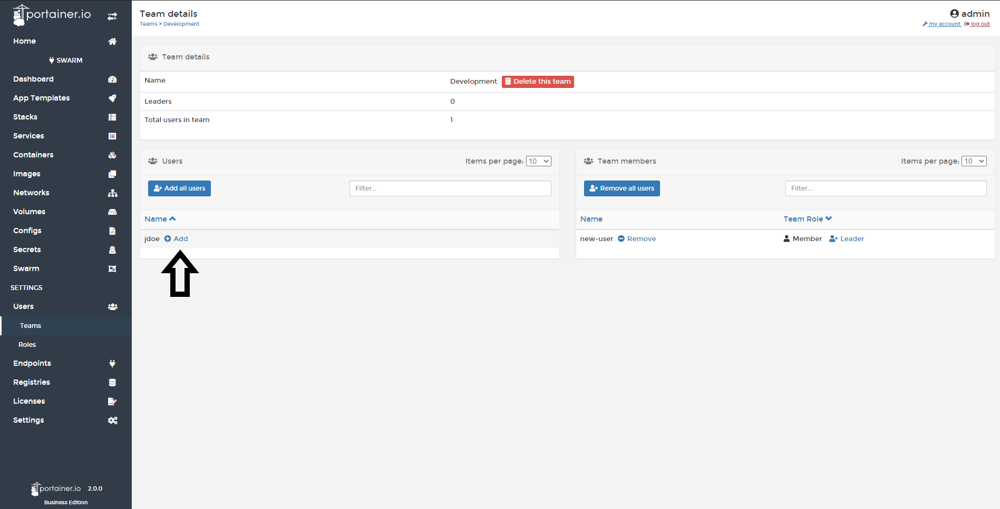

# Add a user to a team

First select <b>Users</b> under <b>settings</b>, then select <b>Teams</b> and choose the team that you want to add users to.

Click <b>Add</b> next to the user you want to add to the team.

You should now see the user under team members

# Notes

[Contribute to these docs](https://github.com/portainer/portainer-docs/blob/master/contributing.md){target=_blank}