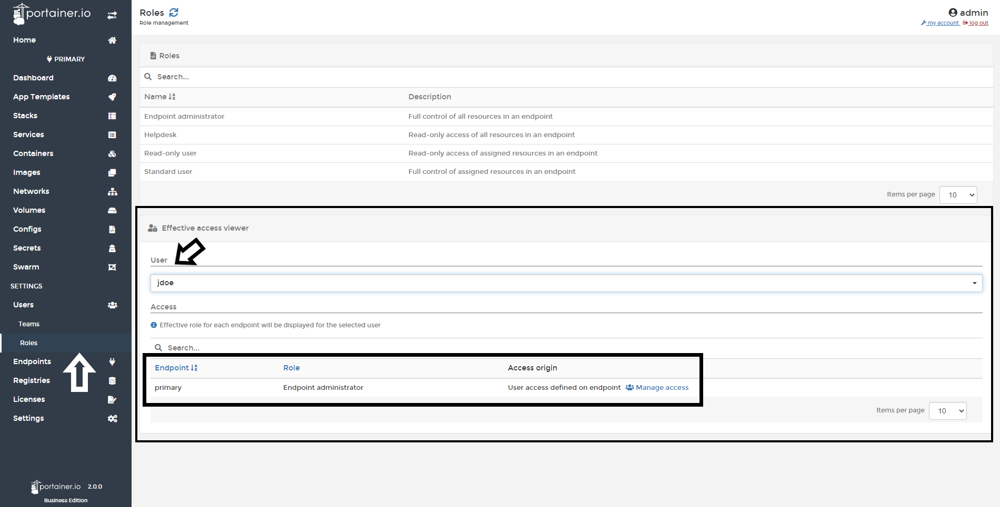

# Effective Access Viewer

In Portainer Business Edition, you will capable to see in a general view what role had each user. 

## Viewing Access

To see what access a user has, click <b>Roles</b>, in <b>Effective access viewer</b> you will see a dropdown menu, pick the user from there and you will see what permissions and where that role was granted to that user.

## Notes

[Contribute to these docs](https://github.com/portainer/portainer-docs/blob/master/contributing.md).